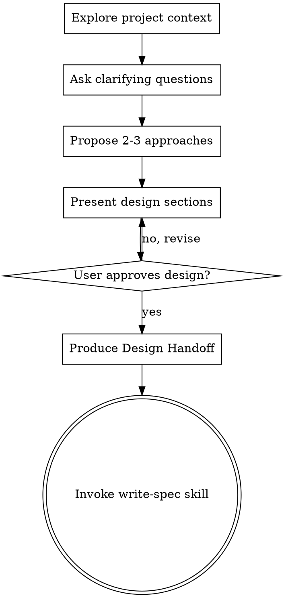

# Brainstorming Ideas Into Designs

Help turn ideas into fully formed designs and specs through natural collaborative dialogue.

Start by understanding the current project context, then ask questions one at a time to refine the idea. Once you understand what you're building, present the design and get user approval.

<HARD-GATE>
Do NOT invoke any implementation skill, write any code, scaffold any project, or take any implementation action until you have presented a design and the user has approved it. This applies to EVERY project regardless of perceived simplicity.
</HARD-GATE>

## Anti-Pattern: "This Is Too Simple To Need A Design"

Every project goes through this process. A todo list, a single-function utility, a config change — all of them. "Simple" projects are where unexamined assumptions cause the most wasted work. The design can be short (a few sentences for truly simple projects), but you MUST present it and get approval.

**Pipeline vs. local fix:** A short design conversation still applies here. The **write-spec → writing-plans → subagent** chain is for work large enough to need a written spec and plan — not for every approved design. When the user asked for a small, pinned change ("fix this error", "rename X", "update this copy"), stop at design approval and implement; do not invoke write-spec unless they want a spec artifact.

## Checklist

You MUST create a task for each of these items and complete them in order:

1. **Explore project context** — check files, docs, recent commits
2. **Offer the visual companion just-in-time** — NOT upfront. The first time a question would genuinely be clearer shown than described, offer it then (its own message); on approval its browser tab opens for you. If no visual question ever arises, never offer it. See the Visual Companion section below.
3. **Ask clarifying questions** — one at a time, understand purpose/constraints/success criteria
4. **Propose 2-3 approaches** — with trade-offs and your recommendation
5. **Present design** — in sections scaled to their complexity, get user approval after each section
6. **Produce Design Handoff** — structured artifact mirroring the spec sections (see below)
7. **Transition to spec authorship** — invoke write-spec skill to write and validate the spec file

## Process Flow



**Terminal state is invoking write-spec** for work that needs a written spec. For small approved changes, implement directly instead — see brainstorming's pipeline vs. local fix note.

## The Process

**Understanding the idea:**

- Check out the current project state first (files, docs, recent commits)
- Before asking detailed questions, assess scope: if the request describes multiple independent subsystems (e.g., "build a platform with chat, file storage, billing, and analytics"), flag this immediately. Don't spend questions refining details of a project that needs to be decomposed first.
- If the project is too large for a single spec, help the user decompose into sub-projects: what are the independent pieces, how do they relate, what order should they be built? Then brainstorm the first sub-project through the normal design flow. Each sub-project gets its own spec → plan → implementation cycle.
- For appropriately-scoped projects, ask questions one at a time to refine the idea
- Prefer multiple choice questions when possible, but open-ended is fine too
- Only one question per message - if a topic needs more exploration, break it into multiple questions
- Focus on understanding: purpose, constraints, success criteria

**Exploring approaches:**

- Propose 2-3 different approaches with trade-offs
- Present options conversationally with your recommendation and reasoning
- Lead with your recommended option and explain why

**Presenting the design:**

- Once you believe you understand what you're building, present the design
- Scale each section to its complexity: a few sentences if straightforward, up to 200-300 words if nuanced
- Ask after each section whether it looks right so far
- Cover: architecture, components, data flow, error handling, testing
- Be ready to go back and clarify if something doesn't make sense

**Design for isolation and clarity:**

- Break the system into smaller units that each have one clear purpose, communicate through well-defined interfaces, and can be understood and tested independently
- For each unit, you should be able to answer: what does it do, how do you use it, and what does it depend on?
- Can someone understand what a unit does without reading its internals? Can you change the internals without breaking consumers? If not, the boundaries need work.
- Smaller, well-bounded units are also easier for you to work with - you reason better about code you can hold in context at once, and your edits are more reliable when files are focused. When a file grows large, that's often a signal that it's doing too much.

**Working in existing codebases:**

- Explore the current structure before proposing changes. Follow existing patterns.
- Where existing code has problems that affect the work (e.g., a file that's grown too large, unclear boundaries, tangled responsibilities), include targeted improvements as part of the design - the way a good developer improves code they're working in.
- Don't propose unrelated refactoring. Stay focused on what serves the current goal.

## After the Design

**Design Handoff** (before write-spec — skip for small local fixes):

Before invoking write-spec, produce a structured handoff the spec author can verify against. Either:

- A markdown block in the session (minimum), or
- A scratch file: `docs/playbook/specs/.handoff/YYYY-MM-DD-<topic>.md` (preferred for long designs)

Required fields mirror the spec sections write-spec will author:

```markdown
# Design Handoff: <topic>

**Size:** S / M / L      **Type:** frontend | backend | data | mixed      **Plan tier:** Direct | Lite | Full

## Approved sections
- [x] Vision (including Target)
- [x] Approach
- [x] Scope
- [x] Decisions
- [x] Not now
- [x] Verification

## Vision
Shared vision in human form — what you intend to build in this project's
context, why it matters, and what is wrong or incomplete about today when
something already exists. As long and as technical as the idea needs.

### Target
The concrete done state as agreed — user flow for frontend, contract or call
sequence for backend, schema for data. Include a Today / baseline only when
something real exists to contrast; greenfield shows Target only.

## Approach
The rule the design turns on, the named units it introduces (name plus what
each is responsible for), and the mechanism choices that are load-bearing.
Name things — this is the part of the conversation that gets lost otherwise.
Names, not file paths.

## Scope
Areas and components involved (named, not file paths), what to reuse rather
than rebuild, docs that constrain the work, guardrails.

## Decisions
| # | Decision | Why |
|---|----------|-----|
| 1 | ... | ... |

## Not now
...

## Verification
Tier (Flow / Component / Check) and the scenarios agreed, if any.

## Affected domains
ui, generation

## Open questions (if any)
...
```

**Size** is your read on how much spec the work needs — write-spec confirms it. **S means no spec at all:** stop at design approval and implement. **Plan tier** is the expected writing-plans tier — Lite for one cohesive capability even across runtimes; Full only when packages could be reviewed independently.

Sketch each section to the depth the conversation reached. Do not invent file paths or code — the spec names components, and the plan names files.

**The mechanism you reasoned through is part of the handoff, not just the transcript.** When the conversation settled on a rule, a set of named units, or a choice of mechanism, write them into `Approach` by name. Anything that exists only in the chat is lost at the handoff, and the spec that follows will describe the behavior while quietly forgetting how it works.

**Handoff to write-spec** (substantive features only):

- Invoke write-spec — it writes the spec, runs review, and gets user approval of the written file
- Do NOT invoke writing-plans directly; write-spec hands off after spec approval
- For small approved changes, skip write-spec and implement directly

## Key Principles

- **One question at a time** - Don't overwhelm with multiple questions
- **Multiple choice preferred** - Easier to answer than open-ended when possible
- **YAGNI ruthlessly** - Remove unnecessary features from all designs
- **Explore alternatives** - Always propose 2-3 approaches before settling
- **Incremental validation** - Present design, get approval before moving on
- **Be flexible** - Go back and clarify when something doesn't make sense

## Visual Companion

A browser-based companion for showing mockups, diagrams, and visual options during brainstorming. Available as a tool — not a mode. Accepting the companion means it's available for questions that benefit from visual treatment; it does NOT mean every question goes through the browser.

**Offering the companion (just-in-time):** Do NOT offer it upfront. Wait until a question would genuinely be clearer shown than told — a real mockup / layout / diagram question, not merely a UI *topic*. The first time that happens, offer it then, as its own message:
> "This next part might be easier if I show you — I can put together mockups, diagrams, and comparisons in a browser tab as we go. It's still new and can be token-intensive. Want me to? I'll open it for you."

**This offer MUST be its own message.** Only the offer — no clarifying question, summary, or other content. Wait for the user's response. If they accept, start the server with `--open` so their browser opens to the first screen automatically. If they decline, continue text-only and don't offer again unless they raise it.

**Per-question decision:** Even after the user accepts, decide FOR EACH QUESTION whether to use the browser or the terminal. The test: **would the user understand this better by seeing it than reading it?**

- **Use the browser** for content that IS visual — mockups, wireframes, layout comparisons, architecture diagrams, side-by-side visual designs
- **Use the terminal** for content that is text — requirements questions, conceptual choices, tradeoff lists, A/B/C/D text options, scope decisions

A question about a UI topic is not automatically a visual question. "What does personality mean in this context?" is a conceptual question — use the terminal. "Which wizard layout works better?" is a visual question — use the browser.

If they agree to the companion, read the detailed guide before proceeding:
`skills/brainstorming/visual-companion.md`
