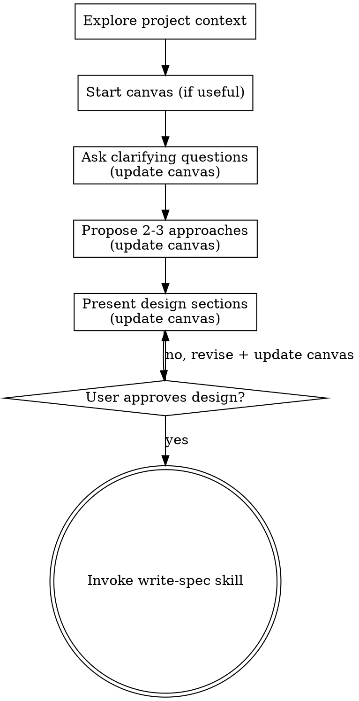

# Brainstorming Ideas Into Designs

Help turn ideas into fully formed designs and specs through natural collaborative dialogue.

Start by understanding the current project context, then ask questions one at a time to refine the idea. Once you understand what you're building, present the design and get user approval.

<HARD-GATE>
Do NOT invoke any implementation skill, write any code, scaffold any project, or take any implementation action until you have presented a design and the user has approved it. This applies to EVERY project regardless of perceived simplicity.
</HARD-GATE>

## Anti-Pattern: "This Is Too Simple To Need A Design"

Every project goes through this process. A todo list, a single-function utility, a config change — all of them. "Simple" projects are where unexamined assumptions cause the most wasted work. The design can be short (a few sentences for truly simple projects), but you MUST present it and get approval.

**Pipeline vs. local fix:** A short design conversation still applies here. The **write-spec → writing-plans → subagent** chain is for work large enough to need a written spec and plan — not for every approved design. When the user asked for a small, pinned change ("fix this error", "rename X", "update this copy"), stop at design approval and implement; do not invoke write-spec unless they want a spec artifact.

## Checklist

You MUST create a task for each of these items and complete them in order:

1. **Explore project context** — check files, docs, design system, existing components, recent commits
2. **Start a Brainstorming Canvas when useful** — early, when the idea is more than a tiny pinned fix. Living sketchpad under `docs/playbook/`; keep it updated as you go. Skip for obvious one-file fixes. See Brainstorming Canvas below.
3. **Ask clarifying questions** — one at a time, understand purpose/constraints/success criteria; **update the canvas** when answers change settled ideas
4. **Propose 2-3 approaches** — with trade-offs and your recommendation; record the chosen direction on the canvas
5. **Present design** — in sections scaled to their complexity, get user approval after each section; keep the canvas the consistent summary of what you have agreed. UI/layout choices as Markdown mockups on the canvas, grounded in the project's existing components and design language — not arbitrary external mockups.
6. **Transition to spec authorship** — mark the canvas approved and invoke write-spec; the canvas is the approved brainstorm summary the spec draws from (one slice at a time if it spans several deliveries)

## Process Flow



**Terminal state is invoking write-spec** (or implementing directly for small approved changes). The canvas is the brainstorming source of truth; the spec is distilled from it — one slice at a time when the canvas is large.

## The Process

**Understanding the idea:**

- Check out the current project state first (files, docs, recent commits)
- Before asking detailed questions, assess scope: if the request describes multiple independent subsystems (e.g., "build a platform with chat, file storage, billing, and analytics"), flag this immediately. Don't spend questions refining details of a project that needs to be decomposed first.
- When the idea is worth a real design conversation (not a typo/rename), **start a Brainstorming Canvas early** — see below. Use it as the collaborative sketchpad so the vision stays consistent while you explore.
- For appropriately-scoped projects, ask questions one at a time to refine the idea
- Prefer multiple choice questions when possible, but open-ended is fine too
- Only one question per message - if a topic needs more exploration, break it into multiple questions
- Focus on understanding: purpose, constraints, success criteria
- When the conversation settles or revises something, **update the canvas** in the same turn so chat drift does not outrun the written vision

**Exploring approaches:**

- Propose 2-3 different approaches with trade-offs
- Present options conversationally with your recommendation and reasoning
- Lead with your recommended option and explain why
- Record the chosen approach (and rejected alternatives briefly) on the canvas

**Presenting the design:**

- Once you believe you understand what you're building, present the design
- Scale each section to its complexity: a few sentences if straightforward, up to 200-300 words if nuanced
- Ask after each section whether it looks right so far
- Cover: architecture, components, data flow, error handling, testing
- Be ready to go back and clarify if something doesn't make sense
- The canvas should already reflect approved sections; treat mismatches as a signal to update the canvas before moving on

**UI and visual choices — project context, not arbitrary design:**

- Ground every layout or interaction choice in this project's existing shell, components, tokens, and patterns (read design-language / frontend docs and reuse pointers first).
- Prefer **Markdown mockups on the canvas** (structure, hierarchy, copy, which existing controls) while brainstorming. That keeps the conversation about *this* product, not a generic wireframe.
- Do not invent a parallel visual system or design in a disconnected companion UI. Discuss choices against real components the app already has.
- In-app / route-level mock pages come later only when useful — typically during or after the spec, when committing to a real surface makes the choice clearer. Brainstorm first on the canvas.

**Design for isolation and clarity:**

- Break the system into smaller units that each have one clear purpose, communicate through well-defined interfaces, and can be understood and tested independently
- For each unit, you should be able to answer: what does it do, how do you use it, and what does it depend on?
- Can someone understand what a unit does without reading its internals? Can you change the internals without breaking consumers? If not, the boundaries need work.
- Smaller, well-bounded units are also easier for you to work with - you reason better about code you can hold in context at once, and your edits are more reliable when files are focused. When a file grows large, that's often a signal that it's doing too much.

**Working in existing codebases:**

- Explore the current structure before proposing changes. Follow existing patterns.
- Where existing code has problems that affect the work (e.g., a file that's grown too large, unclear boundaries, tangled responsibilities), include targeted improvements as part of the design - the way a good developer improves code they're working in.
- Don't propose unrelated refactoring. Stay focused on what serves the current goal.

## Brainstorming Canvas

A **canvas** is the collaborative sketchpad for the brainstorm — started near the beginning of the conversation, updated as you go, and used as the summarized basis for write-spec. It replaces any separate visual-companion workflow: mockups and design choices live here in Markdown, in this project's vocabulary. It is a **temporary playbook artifact**, not canonical product documentation. Durable behavior lands in `docs/knowledge/` (via docdriven) after implementation; then clean up leftovers (see Lifecycle).

**Start a canvas early when** the user's idea needs a design conversation that could drift — a feature, flow, multi-step capability, or anything where keeping a written vision consistent matters. Skip for tiny pinned fixes ("rename X", "fix this typo") where you will implement directly after a short approval.

**Path:** `docs/playbook/canvases/YYYY-MM-DD-<topic>-canvas.md`  
(User preference for location overrides this default.)

**Header every canvas starts with:**

```markdown
# <Topic> — Brainstorming Canvas

> **Status:** Brainstorming | Approved — basis for specs | Implementing | Leftover — ready to delete
>
> Living summary of this brainstorm. Keep it updated when decisions change.
> Specs and plans are distilled from this file. Not canonical product behavior —
> after shipping, durable truth lives in knowledge docs; then delete leftovers
> when documentation is clearly done.
```

Write free-form sections that fit the conversation (promise, principles, journey, Markdown UI mockups, decisions, not-now, open questions). No fixed section list beyond the status header — grow the document as you clarify; rewrite sections so they stay clean rather than appending contradictions. UI mockups name existing project components and patterns where possible.

**During brainstorming:** treat the canvas as the fixed vision. If chat strays or the user revises something, update the canvas before treating the new idea as settled. Prefer short, clear prose over dumping the whole transcript.

**When design is approved:**

1. Mark canvas status **Approved — basis for specs**.
2. If the canvas covers several delivery slices, note a short delivery order (optional temporary roadmap under `docs/playbook/specs/`).
3. Invoke write-spec for the **current** slice. Pass `**Canvas:** …`. write-spec authors one slice distilled from that canvas, not the whole file as one mega-spec.
4. Later slices distill from the same canvas + shipped knowledge — do not paste the whole canvas into every spec.

**Lifecycle (playbook is temporary):**

| Artifact | During work | After ship + docdriven |
|----------|-------------|-------------------------|
| Canvas | Living brainstorm summary → basis for specs | **Delete** when its slices are done and knowledge is clearly updated; **ask** only if other open slices or Depends-on links make ownership unclear |
| Spec / plan | Working files for a slice | **Delete** when durable docs are clearly updated; **ask** only when another open spec still Depends on it or cleanup is ambiguous |

Never treat `docs/playbook/**` as the long-term source of truth for product behavior.

## After the Design

**The mechanism you reasoned through belongs on the canvas, not just in the transcript.** When the conversation settled on a rule, named units, or a mechanism, write them onto the canvas — including what *kind* of thing each unit is and which area owns it. If you also agreed fields or relationships, include those; if not, leave them out. Anything that exists only in the chat is lost.

Do not invent file paths or code — the spec names components, and the plan names files.

**Size** is your read on how much spec the work needs — write-spec confirms it. **S means no spec at all:** stop at design approval and implement. **Plan tier** is the expected writing-plans tier — Lite for one cohesive capability even across runtimes; Full only when packages could be reviewed independently. Note both on the canvas when you mark it approved.

**Transition to write-spec** (substantive features only):

- Invoke write-spec — it writes the spec from the canvas, runs review, and gets user approval of the written file
- Do NOT invoke writing-plans directly; write-spec continues after spec approval
- For small approved changes, skip write-spec and implement directly

## Key Principles

- **One question at a time** - Don't overwhelm with multiple questions
- **Multiple choice preferred** - Easier to answer than open-ended when possible
- **YAGNI ruthlessly** - Remove unnecessary features from all designs
- **Explore alternatives** - Always propose 2-3 approaches before settling
- **Incremental validation** - Present design, get approval before moving on
- **Be flexible** - Go back and clarify when something doesn't make sense
- **Design in project context** - Canvas Markdown mockups using this app's components; no arbitrary external companion UI
