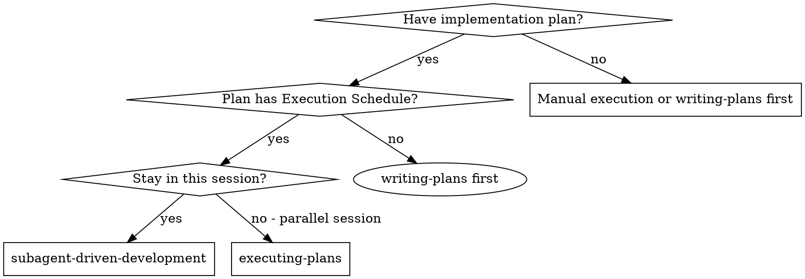
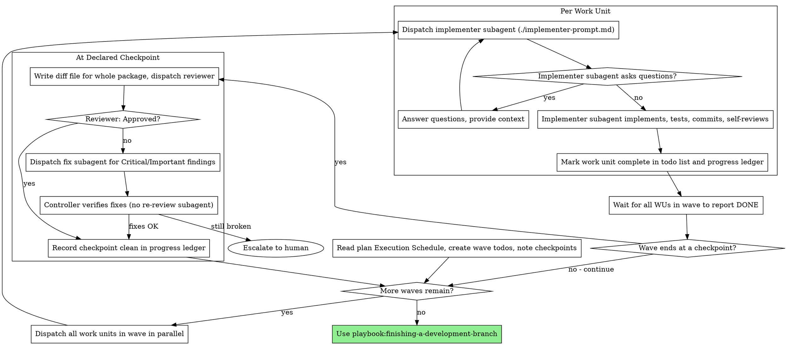

# Subagent-Driven Development

Execute a plan by dispatching a fresh implementer subagent per **work unit**, reviewing at the **checkpoints the plan declares**, fixing once if needed, then **you** verify fixes — no second reviewer loop. Work units in the same **wave** run in parallel; waves run sequentially.

**Why subagents:** You delegate work to specialized agents with isolated context. By precisely crafting their instructions and context, you ensure they stay focused and succeed. They should never inherit your session's context or history — you construct exactly what they need. This also preserves your own context for coordination work.

**Core principle:** Fresh subagent per work unit + review at package boundaries + fix once + controller verifies = high quality without review loops

**Reviews cost real time.** Reviewing after every work unit spends it without producing progress; reviewing only at the very end lets an early mistake get built on. The plan's Execution Schedule already decided where that trade-off falls — honor its `Review` column instead of re-deciding per work unit.

**Narration:** between tool calls, narrate at most one short line — the
ledger and the tool results carry the record.

**Continuous execution:** Do not pause to check in with your human partner between work units. Execute all waves from the plan without stopping. The only reasons to stop are: BLOCKED status you cannot resolve, ambiguity that genuinely prevents progress, or all work units complete. "Should I continue?" prompts and progress summaries waste their time — they asked you to execute the plan, so execute it.

## When to Use



If the plan has no Execution Schedule, run **writing-plans** to add one before dispatching.

**When to skip:** Small changes the user scoped directly — implement inline without subagent dispatch. This skill is for plans with a real Execution Schedule (typically multiple work units or parallel waves). A single obvious edit does not need an implementer subagent and a review gate.

**vs. Executing Plans (parallel session):**
- Same session (no context switch)
- Fresh subagent per work unit (no context pollution)
- Review at the plan's declared checkpoints (spec compliance + code quality)
- Fix once if needed — **you** verify fixes, no second reviewer subagent
- Parallel implementers within a wave when the schedule allows
- Faster iteration (no human-in-loop between work units)

## The Process



## Work Units and Waves

Read the plan's **Execution Schedule** — not the full task list — to build your dispatch order.

| Concept | Meaning |
|---------|---------|
| **Work unit (WU)** | One subagent dispatch. May span Tasks N–M in the plan. |
| **Wave** | Work units that can run in parallel. Same wave = no dependency between them + disjoint write files. |
| **Checkpoint** | A review gate the plan placed on a work unit — reviews everything since the previous checkpoint. |

**Within a wave:** dispatch all work units in the same response (parallel). Wait for every work unit in the wave to report DONE before starting the next wave.

**Across waves:** sequential. Wave 2 starts only after all Wave 1 work units are complete — and after the checkpoint review clears, if the wave ended at one.

**Single work unit in a wave:** still a wave — just not parallel. Label it Wave 1, Wave 2, etc.

## Review Checkpoints

Read the `Review` column of the Execution Schedule. Work units marked `✅ checkpoint` get a review; the rest complete and hand straight on to the next work unit.

**A checkpoint reviews the whole package, not the last work unit.** Its diff base is the commit at the **previous checkpoint** (or the plan's base commit for the first one), so the reviewer sees every work unit since the last gate as one diff. This is deliberate: integration mistakes between work units are exactly what a single-unit review cannot see.

Record `CHECKPOINT_BASE` at the start of execution (the plan's base commit) and update it to HEAD each time a checkpoint clears.

Two checkpoints are always present because writing-plans requires them:

| Checkpoint | Reviews | Template |
|------------|---------|----------|
| Last code work unit | The whole implementation diff | [task-reviewer-prompt.md](task-reviewer-prompt.md), or the `requesting-code-review` skill's `code-reviewer.md` for a large branch |
| Documentation work unit | Doc updates against the implemented diff | [task-reviewer-prompt.md](task-reviewer-prompt.md) |

The final checkpoint **is** the whole-branch review — there is no separate end-of-plan review pass on top of it. When the accumulated diff is large or spans subsystems, run it with the `code-reviewer.md` template and the most capable available model.

**If the plan has no `Review` column** (written before checkpoints existed), fall back to reviewing at the end of each wave, and tell the user the plan predates checkpoint scheduling. Do not review after every work unit.

## Pre-Flight Scan

Before dispatching Wave 1, scan the Execution Schedule once for conflicts:

- work units that contradict each other or the plan's Global Constraints
- parallel wave assignments that share write files (should have been caught in plan review — fix before dispatch)
- anything the plan explicitly mandates that the review rubric treats as a defect
- a missing documentation work unit at the end, or missing checkpoints on the last code work unit and the documentation work unit

Fix plan issues yourself or ask the user only when the plan contradicts itself and you cannot resolve it. If the scan is clean, proceed without comment.

## Model Selection

Use the least powerful model that can handle each role to conserve cost and increase speed.

**Mechanical implementation** (isolated functions, complete code in plan, 1-2 files): use a fast, cheap model.

**Integration and judgment** (multi-file coordination, pattern matching, debugging): use a standard model.

**Architecture and design**: use the most capable available model. The final
checkpoint reviews the accumulated branch — dispatch it on the most capable
available model.

**Review tasks**: choose the model with the same judgment, scaled to the
diff's size, complexity, and risk.

**Always specify the model explicitly when dispatching a subagent.** An
omitted model inherits your session's model — often the most capable and
most expensive — which silently defeats this section.

**Turn count beats token price.** Use a mid-tier model as the floor for
reviewers and for implementers working from prose descriptions. When the
work unit's plan text contains the complete code to write, the
implementation is transcription plus testing: use the cheapest tier for
that implementer.

**Work unit complexity signals (implementation):**
- Touches 1-2 files with a complete spec → cheap model
- Touches multiple files with integration concerns → standard model
- Requires design judgment or broad codebase understanding → most capable model

## Handling Implementer Status

Implementer subagents report one of four statuses. Handle each appropriately:

**DONE:** Mark the work unit complete in the ledger. If this work unit carries a checkpoint (and every work unit in its wave has reported DONE), generate the review package — `scripts/review-package CHECKPOINT_BASE HEAD` from this skill's directory; it prints the unique file path it wrote — and dispatch the reviewer with the printed path. `CHECKPOINT_BASE` is the commit where the previous checkpoint cleared, never `HEAD~1`, which silently drops all but the last commit. If this work unit has no checkpoint, continue to the next work unit without review.

**DONE_WITH_CONCERNS:** The implementer completed the work but flagged doubts. Read the concerns before proceeding — do not defer them to the next checkpoint. If the concerns are about correctness or scope, resolve them now, even if the next review gate is several work units away. If they're observations (e.g., "this file is getting large"), note them for the checkpoint reviewer and continue.

**NEEDS_CONTEXT:** The implementer needs information that wasn't provided. Provide the missing context and re-dispatch.

**BLOCKED:** The implementer cannot complete the work unit. Assess the blocker:
1. If it's a context problem, provide more context and re-dispatch with the same model
2. If the work unit requires more reasoning, re-dispatch with a more capable model
3. If the work unit is too large, split it in the plan and re-run writing-plans — or break into a smaller dispatch for this session with human approval
4. If the plan itself is wrong, escalate to the human

**Never** ignore an escalation or force the same model to retry without changes.

## Handling Review Findings

**Approved:** Record the checkpoint clean in the ledger and set `CHECKPOINT_BASE` to HEAD.

**Needs fixes (Critical/Important):**
1. Dispatch one fix subagent with the reviewer's finding list
2. **Controller verifies** — do not re-dispatch the reviewer subagent
3. Read the fix diff against each Critical/Important finding
4. Re-run the test commands the implementers reported (you, not a new reviewer)
5. If fixes address all findings → record the checkpoint clean, advance `CHECKPOINT_BASE`
6. If still broken after one fix pass → escalate to the human; do not loop

**One fix pass per checkpoint.** No implement → review → fix → review cycles.

When findings span several work units in the package, one fix subagent handles them all — it has the whole diff. Split into parallel fix dispatches only when the findings touch disjoint files.

The reviewer may report "⚠️ Cannot verify from diff" items — requirements
that live in unchanged code or outside the package. Resolve each yourself
before clearing the checkpoint: you hold the plan and cross-package context
the reviewer lacks. If you confirm an item is a real gap, include it in the
fix dispatch.

## Parallel Execution Rules

**Do:**
- Dispatch all work units in the current wave in one response (parallel)
- Verify the Execution Schedule assigns disjoint write files within a wave
- Wait for all work units in a wave to report DONE before starting the next wave
- Clear a wave-ending checkpoint before starting the next wave
- Keep `CHECKPOINT_BASE` current — it is the diff base for the next review

**Don't:**
- Start Wave N+1 while Wave N has an open checkpoint review or unfixed Critical/Important findings
- Dispatch parallel work units that write the same file — merge conflicts will waste more time than sequential dispatch
- Advance `CHECKPOINT_BASE` before a checkpoint clears — the next reviewer would never see the skipped commits

If parallel work units conflict at merge time, stop, resolve manually or with a fix subagent, then continue.

## Constructing Reviewer Prompts

Checkpoint reviews are scoped gates. When you fill a reviewer template:

- Do not add open-ended directives without a concrete, package-specific reason
- Do not ask a reviewer to re-run tests the implementers already ran on the
  same code — their reports carry the test evidence
- Do not pre-judge findings for the reviewer
- Copy global constraints verbatim from the plan
- Hand the reviewer its diff as a file via `scripts/review-package CHECKPOINT_BASE HEAD`
- Name every work unit in the package and pass each of their briefs and reports — the reviewer is judging the package, not one dispatch
- A dispatch prompt describes the package, not the session's history
- Dispatch fix subagents for Critical and Important findings — then **you** verify fixes

**Final checkpoint:** run `scripts/review-package MERGE_BASE HEAD` instead of
`CHECKPOINT_BASE`, so the last gate sees the whole branch, and dispatch
`playbook:requesting-code-review`'s code-reviewer template when the branch is
large or spans subsystems. There is no additional review after it.

## File Handoffs

Everything you paste into a dispatch prompt stays resident in your context.
Hand artifacts over as files:

- **Work unit brief:** before dispatching an implementer, run this skill's
  `scripts/work-unit-brief PLAN_FILE FIRST_TASK LAST_TASK` — it extracts
  the task range for the work unit and prints the brief path. For a
  single-task work unit, pass the same number twice. Compose the dispatch:
  (1) one line on where this work unit fits (wave, dependencies); (2) the
  brief path — "read this first, it is your requirements"; (3) interfaces
  from completed work units the brief cannot know; (4) ambiguity resolution;
  (5) report-file path and report contract.
- **Report file:** `wu-<FIRST>-<LAST>-report.md` (or `wu-<N>-report.md` when
  FIRST equals LAST) in the same directory as the brief.
- **Reviewer inputs:** brief file, report file, review package, global constraints.
- Fix dispatches append to the same report file.

Legacy: `scripts/task-brief` still works for single-task extraction when
FIRST equals LAST and you prefer `task-N-*` naming.

## Durable Progress

Track progress by **work unit**, not plan task.

- At skill start, check for a ledger:
  `cat "$(git rev-parse --git-path sdd)/progress.md"`. Work units listed as
  complete are DONE — do not re-dispatch; resume at the first incomplete wave.
- When a work unit reports DONE, append:
  `WU-N (tasks A–B): complete (commits <base7>..<head7>)`.
- When a checkpoint clears, append:
  `CHECKPOINT after WU-N: clean (package <base7>..<head7>) — CHECKPOINT_BASE now <head7>`.
  This line is how you recover the correct diff base after compaction.
- The ledger is your recovery map after compaction — trust it and `git log`
  over your own recollection.

## Prompt Templates

- [implementer-prompt.md](implementer-prompt.md) - Dispatch implementer subagent
- [task-reviewer-prompt.md](task-reviewer-prompt.md) - Dispatch checkpoint reviewer (spec compliance + code quality)
- Final checkpoint on a large or cross-subsystem branch: the `requesting-code-review` skill's `code-reviewer.md`
- [docs-work-unit-template.md](docs-work-unit-template.md) - What the final documentation work unit does

## Example Workflow

```
You: I'm using Subagent-Driven Development to execute this plan.

[Read Execution Schedule:
 WU-1 tasks 1–2 wave 1, review —
 WU-2 tasks 3–4 wave 1, review —
 WU-3 task 5 wave 2 depends WU-1+WU-2, review ✅ checkpoint
 WU-4 task 6 wave 3 depends WU-3, docs update, review ✅ checkpoint]
[Create todos by wave; record CHECKPOINT_BASE = plan base commit]

Wave 1 (parallel):

[Run work-unit-brief plan.md 1 2 → wu-1-2-brief.md; dispatch WU-1 implementer]
[Run work-unit-brief plan.md 3 4 → wu-3-4-brief.md; dispatch WU-2 implementer]
# Both dispatches in the same response

WU-1 implementer: DONE — auth types + store, 2 commits, 8/8 passing
WU-2 implementer: DONE — export parser, 3 commits, 12/12 passing

[No checkpoint on either — mark both complete in ledger, continue straight to Wave 2]

Wave 2:

[Run work-unit-brief plan.md 5 5; dispatch WU-3 implementer]
WU-3: DONE — export API wiring, 1 commit, 6/6 passing

[Checkpoint: package is WU-1 + WU-2 + WU-3]
[review-package CHECKPOINT_BASE HEAD → one diff covering all three]
Reviewer: Important finding — parser errors not surfaced by the API wiring
# an integration gap no single-work-unit review would have seen
[fix subagent → controller verifies diff + re-runs tests]
Controller: finding addressed. Checkpoint clean, CHECKPOINT_BASE = HEAD.

Wave 3:

[Run work-unit-brief plan.md 6 6; dispatch WU-4 docs implementer]
WU-4: DONE — read diff, found 3 stale docs + 1 route shard, updated, 1 commit

[Final checkpoint: review-package MERGE_BASE HEAD → whole branch]
Reviewer: All requirements met, docs match implementation, ready to merge

Done! (2 reviews for 4 work units)
```

## Advantages

**vs. Manual execution:**
- Subagents follow TDD naturally
- Fresh context per work unit
- Parallel work units in a wave when the schedule allows
- Subagent can ask questions before and during work

**vs. Executing Plans:**
- Same session (no handoff)
- Continuous progress
- Review checkpoints come from the plan, not from ceremony

**Efficiency gains:**
- Work units sized for subagent economics — not one dispatch per 5-minute step
- Reviews at package boundaries — a handful of gates instead of one per work unit
- Parallel waves when the plan allows
- Bulk artifacts move as files, not pasted text

**Quality gates:**
- Self-review before handoff
- Package review at each declared checkpoint (spec + quality + integration)
- Fix once + controller verification — no review loop
- Final checkpoint covers the whole branch, including the documentation update

## Red Flags

**Never:**
- Start implementation on main/master without explicit user consent
- Execute a plan with no Execution Schedule
- Skip a declared checkpoint, or accept a report missing either verdict
- Add a review after a work unit the plan did not mark as a checkpoint
- Skip the final documentation work unit — a plan whose docs are stale is unfinished
- Proceed with unfixed Critical/Important findings
- Dispatch parallel work units that write the same files
- Start the next wave while a wave-ending checkpoint is open
- Review a checkpoint against `HEAD~1` instead of `CHECKPOINT_BASE` — it hides most of the package
- Make a subagent read the whole plan file (use `work-unit-brief` instead)
- Skip scene-setting context
- Ignore subagent questions
- Re-dispatch a work unit the progress ledger already marks complete
- Dispatch a reviewer without a diff file — run `review-package` first
- Re-dispatch a reviewer after a fix pass — controller verifies instead

**If reviewer finds issues:**
- Dispatch one fix subagent with the finding list
- Controller verifies fixes — do not re-dispatch the reviewer
- Escalate to human if still broken after one fix pass

**If subagent fails:**
- Dispatch fix subagent with specific instructions
- Don't fix manually (context pollution)

## Integration

**Required workflow skills:**
- **playbook:using-git-worktrees** - Isolated workspace
- **playbook:writing-plans** - Creates the plan and Execution Schedule
- **playbook:requesting-code-review** - Final whole-branch review template
- **playbook:finishing-a-development-branch** - Complete development after all work units

**Subagents should use:**
- **playbook:test-driven-development** - TDD for each step within the work unit

**Alternative workflow:**
- **playbook:executing-plans** - Parallel session instead of same-session execution
