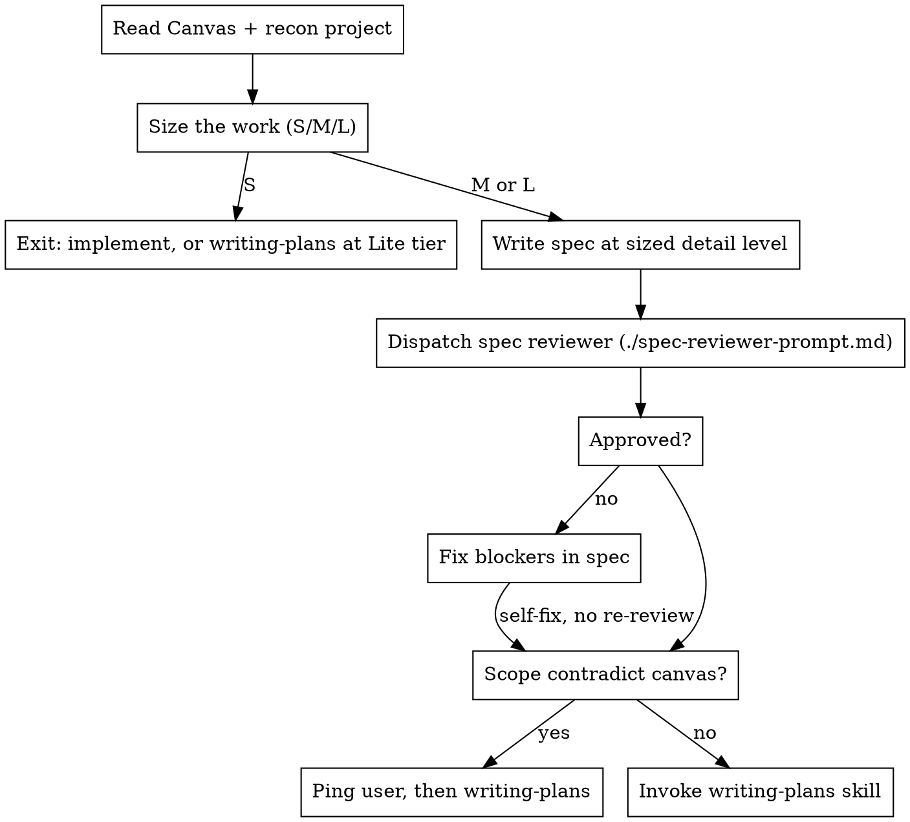

# Write Spec

## Overview

Author and validate a design spec from an approved canvas. Size the work, write the spec, run **one** review pass, then invoke writing-plans. Do not wait for the user to approve the spec.

A spec is the **contract between the canvas and the planning agent**. The canvas is the thinking document the user approved. The spec formalizes what to build and already did the project homework so the planner does not have to rediscover the system. It is not an implementation plan. Source file paths (`src/...:134`), code blocks, and step sequences belong in writing-plans. Product names the canvas settled belong in the spec.

**Announce at start:** "I'm using the write-spec skill to author and validate the design spec."

**Inputs:** Approved brainstorming **Canvas** (`docs/playbook/canvases/...`) when one exists; otherwise the approved design in this session.

**Outputs:**
1. Spec file: `docs/playbook/specs/YYYY-MM-DD-<topic>-design.md` — **temporary** working artifact, not durable product knowledge
2. Optional companion — same directory, `YYYY-MM-DD-<topic>-<kind>.md` where `<kind>` is `roadmap` or `adr` (roadmap is temporary with the canvas; keep an ADR only when the team wants a durable decision record outside knowledge docs)

**Not an output: documentation updates.** This skill never edits canonical docs and never guesses which docs will need editing. Canonical docs explain current truth, and the code does not exist yet. Every plan's final work unit discovers and performs the doc updates from the real diff — see writing-plans. After that, leftover playbook files may only hold remaining work: delete or strip specs/plans/canvases; ask only when dependencies or ownership are unclear.

## Checklist

You MUST create a task for each item and complete them in order:

1. **Read the Canvas** — the approved brainstorm this spec covers; if there is no canvas, use the approved design in this session
2. **Recon the project** — look at the real system for where this lives, what already exists, and which docs bind it
3. **Carry what the conversation already settled** — summary into Target, mechanism into Approach when needed, exclusions into Not now; keep the canvas nouns
4. **Size the work** — S / M / L; **S exits this skill**
5. **Write the spec** — at the detail level the size allows, save to `docs/playbook/specs/`
6. **Review pass** — dispatch one reviewer, fix blockers yourself, no re-review
7. **Conflict ping or continue** — ping the user only if Scope contradicts the canvas; otherwise invoke writing-plans

## Process Flow



**The terminal state is invoking writing-plans.** Do NOT write implementation plans, code, or invoke subagent-driven-development here.

<HARD-GATE>
Do NOT invoke writing-plans until the review pass is clean (or its blockers are fixed). Do NOT wait for the user to approve the spec. Ping them only when Scope contradicts the canvas. Do NOT edit canonical documentation in this skill. Do NOT commit unless the user requests a commit.
</HARD-GATE>

The user already approved the canvas. A spec approval pause is not a gate. Do not ask them to read the spec before planning.

## Step 1: Carry what the conversation already settled

After reading the canvas (or the approved design in session), **look at the project**. Scope is not inferred from the chat. Find where this lives, what already exists, and which docs constrain it.

Then put settled content in the section that owns it. Target is a readable summary of what we are building, not a packed inventory. Point at the canvas for copy and long detail. Keep the nouns.

- **Vision** gets intent and why.
- **Target** gets the written-out summary of what we are building from the canvas. If the canvas named `hero-dashboard-{locale}@2x.png`, Target says that, not "a retina asset pair".
- **Approach** gets kinds, conceptual homes, and mechanisms **only when Target plus Scope would not already tell the planner what to do**.
- **Scope** gets the project map from the recon.
- **Not now** gets exclusions.

Skip inventing columns, enums, schemas, or file names that were never discussed. Do not replace a settled name with a category to look less like a plan.

## Step 2: Size the work

Detail is proportional to size. Decide the size **before writing anything**, and state it in the spec header.

| Size | Looks like | What to write |
|------|------------|---------------|
| **S** | One contained change: a component tweak, a copy change, a fix with a known cause, one endpoint's behavior | **No spec.** Implement directly, then **delete** the canvas if nothing remains open or **remove** the shipped work if remaining work is still on it. Write a **Lite** plan when the user wants an artifact — say the tier out loud so writing-plans does not default to its Full shape. |
| **M** | One capability or contained change — even when it touches several files, runtimes, or domains. No new product flow; Verification is usually a short Check walkthrough | `Vision` (with `Target`), `Scope`, short `Verification`, plus `Approach` when the design introduces named units or picks a mechanism. Skip `Not now` when there is nothing to exclude. **Usual plan tier: Lite.** |
| **L** | Multiple independent capabilities in one spec, a complete user/system flow, or a new subsystem with Flow-level verification. Touching several domains alone is not L | All sections. **Usual plan tier: Full.** |

**Announce the size and why** in one sentence before writing. If the user disagrees, take their size.

**Multi-domain ≠ L.** A shared-package extraction, a cross-runtime contract move, or a change that lists several Affected domains is still M when it is one capability that stands or falls together. L is for scope that could be split into separate specs, or for a flow others will extend as a subsystem.

Brainstorming already decided whether a spec is warranted at all ("pipeline vs. local fix"). This step decides how much spec. When brainstorming invoked this skill but the work is clearly **S**, say so and move on — do not pad a small change into a full spec. Implement, then delete or strip the canvas the same way.

**Size travels downstream.** Put the expected plan tier in the header (`Direct` / `Lite` / `Full`). writing-plans owns the final call and the tier definitions, but it starts from this hint — do not leave it blank and let "several files" upgrade an M spec into a Full plan.

## Step 3: Spec Format

Fixed section order. Section names are literal — use them verbatim.

| Section | Answers | Content rules |
|---------|---------|---------------|
| **Vision** | What are we doing, and why? | Short prose: problem, intent, why it matters. Canvas link lives in the header. Ends with **`### Target`**. Does not recap Approach. |
| **Target** | What are we building? | Readable summary of the canvas outcomes. Keep settled names. Point at the canvas for copy and long detail. Not a packed noun dump. |
| **Approach** | How does it work, when that is not already obvious? | Named units with kind + conceptual home; mechanisms and why. Skip when Target plus Scope already tell the planner what to do. |
| **Scope** | Where does this live in our project, and what must be respected? | Project map: where to work, what is already there and where to find it, areas, docs to read, skills, guardrails. The author reconned this. |
| **Not now** | What are we not building? | Explicit exclusions, one per line. |
| **Verification** | What can you walk through when this is done? | One walkthrough, plus evidence (screenshots for UI). Not a policy recap or unit-test inventory. |

**Target is a summary, not an inventory.** Write it so a planner knows the outcome in one sitting. Packed paragraphs that list every heading, ban, component, and button in one block fail. Keep the canvas nouns; do not encode the whole canvas as telegram.

**Each fact lives in one section.** Repeating a name to walk through it is fine. Repeating the rule, the why, or the full description is not.

| Section | Owns | Does not own |
|---------|------|----------------|
| **Vision** | Problem, intent, why. Short baseline if something exists today. | Mechanism, walkthrough, project map |
| **Target** | What we are building, written out from the canvas. | How it works, where it lives in the repo, why a choice won |
| **Approach** | Named units (kind + home + rule). Load-bearing why. Unchanged. | Repeating Target. `src/...` file paths. |
| **Scope** | Where to work, what already exists and where to find it, docs, skills, guardrails | Canvas restated as bullets |
| **Verification** | One walkthrough that would change a ship decision | Re-explaining Approach units or Target policy |

**Prefer prose over tables.** Specs are contracts a planner reads. Tables are allowed only when a comparison is genuinely clearer as a grid (rare). Target, Approach, and Verification use tight sentences or short bullets — not essays, not telegram. Verification may be a light numbered walkthrough. A spec that is mostly tables, or that tells the same fact in Vision, Target, Approach, and Verification, fails review.

**Header block** — every spec starts with it:

```markdown
**Size:** M      **Type:** frontend      **Plan tier:** Lite      **Depends on:** —      **Canvas:** —
```

`Type` is `frontend`, `backend`, `data`, or `mixed`. It steers what Target should describe, not which table template to fill. `Plan tier` is the expected writing-plans tier (`Direct` / `Lite` / `Full`) — writing-plans may revise it, but only with a stated reason. `Canvas` links the brainstorming canvas this spec was distilled from; use `—` when there was none.

**`Depends on` — one canonical spec per concept.** Before writing, scan `docs/playbook/specs/` for specs whose subject overlaps this one. Declare each as a link with its relation: **depends on** (this consumes a contract, model, or flow that spec defines), **supersedes** (this replaces part of it — name the part), or **overlaps** (both touch a shared surface that could drift — name the surface). Reference the other spec's content; never restate it. Restated content becomes a second source of truth and will drift. Use `—` when there are none.

**Readability test:** after Vision (including Target), would a planner who missed the brainstorm know what we are building and the names the canvas used? If Target is a packed inventory they have to decode, it fails. If they would notice the same rule or description three times, it also fails.

### Vision

Write what you intend to do with this work, for a planner who was not in the brainstorm. Length follows the idea: a small capability may need a paragraph; a cross-domain redesign may need more. Be as technical as the idea needs to be clear. Source paths and step sequences still belong in the plan, not here.

Cover the problem or opportunity in this project's context, what you intend to build, why it matters, and, when something already exists, what is wrong or incomplete about today. Do not pad. Do not recap Approach here. Target, immediately below, names what we are building.

Every Vision ends with a **`### Target`** subsection. Write the done state as a summary a planner can hold: what exists when this is finished, how the important surfaces behave, what is gone. If the canvas named files, types, fields, screens, commands, or assets, use those names. Do not replace a name with a category. Point at the canvas for long copy. Source paths (`src/...`) stay in the plan.

**Example.** The canvas named `hero-dashboard-{locale}@2x.png` and `@4x.png` for every published locale. Target keeps those names. "A retina asset pair per locale" is a failed Target. A single paragraph that also lists every ban, button, and illustration mapping is also a failed Target. Split: Target states the outcome; Scope states where those pieces live.

By `Type`, make sure Target covers the right kind of done state:

| Type | Cover in prose |
|------|----------------|
| **frontend** | What the user sees and can do when it is done; important UI states |
| **backend** | Who calls what, and what contracts or results exist at done |
| **data** | What the model or derivation looks like at done, and which consumers care |
| **mixed** | The cross-boundary outcome once, with the names that exist at done. Not one mini-essay per layer, and not a category in place of those names |

**Baseline is optional.** When something already exists, say what is wrong with today inside Vision or Target in a sentence or two. Greenfield needs no fake before-state.

Approach owns how the design works; Target owns what we are building; Scope owns where it sits in this project. Do not turn Target into a mechanism dump or a project map.

**UI mockups:** Brainstorm already put Markdown mockups on the canvas, grounded in this project's components. During or after the spec, only promote those into a real in-app / route mock when that would clarify a still-open choice — do not redesign arbitrarily outside the project's design system.

### Approach

The design the brainstorm settled, at a level someone can hold in their head, **when that how is not already obvious from Target plus Scope**. Skip this section when the change is "write a record in the usual shape" or other work with an obvious implementation. L always includes it. M includes it when the design introduces named units or picks a mechanism.

Write tight sentences or short bullets — two to four sentences per named unit, not an essay wrapping it. Cover:

- **The rule** — the one or two sentences that make the change coherent, plus any corollaries.
- **Named units** — `**Name** — kind, conceptual home. Rule. Why, when the choice is load-bearing.` Say (1) **what kind of thing it is** (UI step, durable record, shell mode, entry use-case, gate, bootstrap hook, …), (2) **which area owns it** conceptually (onboarding domain, workspace shell, Career Profile, …), and (3) what it is responsible for. Source paths (`src/...`) stay in the plan. Product names the canvas used stay here. Do not recap other units or Target.
- **Settled shapes** *(only if the conversation already went there)* — fields, relationships, or payloads next to the unit they belong to. Omit when brainstorm stayed at intent; do not invent a model to look complete.
- **Mechanism and why** — the load-bearing choices *and* why they won. Decisions live here, next to the thing they decide.
- **Unchanged** — what this deliberately leaves alone, so the plan does not go looking.

**Level test — kind and home, not source locations.** “A durable onboarding workflow record owned by the onboarding domain” belongs here. `src/onboarding/...` and SQL belong in the plan. Asset contracts, type names, routes, and field lists the canvas already used also belong here or in Target, depending on which section owns them. Field lists belong here only when already agreed.

**No separate Decisions section.** A standalone Decisions table is legacy. If you find yourself building one, fold each row into the Approach paragraph it belongs to.

### Scope

This is the project half of the contract. The author looked at the real system. The planner should already know where to work and where to find things.

Cover, in short bullets:

- **Where this lives** — where the agent should work: the area, shell, folder family, catalog, or knowledge location. "The experiment backlog and the campaign-link catalog", not `src/features/export/ExportDialog.tsx:134`.
- **What is already there** — existing pages, records, components, or docs, and where to find them. Use, change, or leave. This is the architecture check.
- **Areas involved** — named at component or area level
- **Docs to read** — the canonical docs that *constrain* this work (see below)
- **Skills to use** — the domain skills that govern this work
- **Guardrails** — what the implementer must not violate, including that knowledge files stay in the existing readable shape when this work produces docs. Do not paste the canvas into canonical docs.
- **Affected domains** — DocDriven domain IDs from `docs/agent/manifest.json`, when the project uses them. The plan's documentation work unit uses these to load route shards.

**Docs to read** is not a generic pointer at the docs folder — name the specific documents this work must obey, chosen by what is being built. Read the project's `docs/agent/manifest.json` route shards for the affected domains and take their `readFirst` entries as the starting point, then add anything the work type demands:

| Work involves | Name docs like |
|---------------|----------------|
| Frontend / UI | Frontend architecture, design language and visual system, component and state conventions, accessibility baseline |
| Backend / API | Backend architecture, API and contract conventions, auth and permission model, error and logging conventions |
| Data / schema | Data model doc, migration policy, derivation and read-model rules |
| Integrations / machine-to-machine | The integration's own contract doc, retry and idempotency policy, secret and credential handling |
| Infrastructure / deployment | Environment and config doc, deployment and rollback policy |

The list should be short and specific: three or four documents an implementer must read before starting, not everything that mentions the topic. If a needed doc does not exist, say so — that is a gap worth recording rather than an excuse to invent conventions.

**Skills to use** names the domain skills the implementer should invoke — the Supabase skill for edge functions and Postgres, the frontend design skill for new interface surfaces, the shadcn skill for component work, and so on. The plan repeats them per task; the spec establishes which apply at all.

**Docs to read are not docs to update.** Which docs need *updating* is discovered after the code exists — the plan's final work unit runs a change-scoped docdriven audit against the real diff. Do not try to predict that list here. When the work *is* knowledge records, Target names those records; the plan still discovers leftover index updates from the diff.

If this recon finds that the canvas cannot land as approved — missing primitive, a doc that contradicts the locked design, work that would rewrite something the canvas left alone — **stop and ping the user** before writing the plan. That is the only spec-time user gate.

### Verification

Describe **what someone should be able to walk through when this work is done** — the expected delivered flow, not a test-case inventory and not a recap of Approach.

Write it as a readable path (short paragraphs or a light numbered walkthrough). Name the surfaces as you walk them; do not re-explain their rules. Formal Given/When/Then is optional and usually worse here.

**By type:**

| Type | Verification reads like |
|------|-------------------------|
| **frontend** / **mixed with UI** | A **user flow**: which screens or steps exist, how you enter them, where you can go next (continue / back / exit), what you confirm along the way, and what done looks like. Name the path, not every assertion. **Evidence:** screenshots of the finished routes or states. |
| **backend** / **data** | A **verify path**: which functions or contracts exist, which schemas or records are in place, who can call what, and what observable result proves it (command, response shape, persisted row). No fake user journey. |
| **mixed** | One cross-boundary walkthrough when the UI and backend meet; do not split into two mini-test plans. |
| **docs / records** | The files exist, indexes link, the record is complete for its phase. |

**Default lean.** Prefer extending or running checks that already exist over inventing a new unit-test suite in the spec. Over-specifying tests is a review failure: a bullet list that mirrors every Approach unit usually means the spec is doing the plan's job.

State a tier so the plan knows how heavy to automate:

| Tier | When | What the prose covers |
|------|------|------------------------|
| **Check** | Most M work; refactors; ownership moves | A short verify path — one or two things you can observe or run |
| **Component** | One contained capability with real branches | The main happy path plus the branches that would change a ship decision |
| **Flow** | A complete user or system journey | The end-to-end walkthrough (screens or call sequence) for this work |

Keep it short enough to read once. If it turns into a QA checklist or restates Approach policy, cut to the path that would change a ship decision.

This section is acceptance criteria for the plan. writing-plans turns it into verification steps; it must not invent a unit test for every named Approach unit unless the flow actually requires it.

### Global constraints (optional)

Project-wide requirements that bind every task: version floors, dependency limits, naming and copy rules. Include only when they exist. writing-plans copies this section into the plan verbatim.

### Canonical Template

````markdown
# <Feature Name>

**Size:** M      **Type:** mixed      **Plan tier:** Lite      **Depends on:** —      **Canvas:** —

## Vision

<Short prose: what you are doing in this project's context, why it
matters, and what is wrong or incomplete about today when something already
exists. Do not recap Approach.>

### Target

<Readable summary of what we are building, using the names the canvas
already used. Point at the canvas for long copy. Not a packed inventory.
Source paths stay in the plan.>

## Approach

<Optional. The governing rule and named units when Target plus Scope would
not already tell the planner what to do. Skip when the implementation
shape is obvious.>

## Scope

**Where this lives**
- ...

**What is already there**
- ... — where to find it

**Areas involved**
- ...

**Docs to read**
- `docs/knowledge/...` — why this one constrains the work

**Skills to use**
- ...

**Guardrails**
- ...

**Affected domains:** ...

## Not now
- ...

## Global constraints
- ... (optional)

## Verification

**Tier:** Flow | Component | Check

<One walkthrough when this work is done. For UI: screens, navigation, what
you confirm, plus screenshots. For backend: contracts, schemas, and the
observable verify path. Name surfaces; do not re-explain their rules.>
````

There is no doc-impact section. Documentation updates are discovered from the real diff and performed by the plan's final work unit.

**Legacy specs** may use Problem / Goal / Non-Goals / Design / Testing Strategy, a standalone Decisions table, Today/Done grids, the older Vision Contract, or a top-level `Now → Target` section. Migrate when implementation touches them: fold decisions into Approach prose, Target into free text under Vision, and Blueprint file-level detail into the plan.

## Step 4: Review Pass

**One pass. One reviewer. No re-review.** Iterations that do not change the outcome are waste — the reviewer reports, you fix, you move on.

**Review subagent:** Check whether your runtime has a dedicated review subagent configured. **OpenCode:** use your `review` subagent (`Subagent (review):` in the prompt template). **Other runtimes:** look in platform config, agent manifests, or project docs for a subagent named `review`, `code-reviewer`, or similar with readonly/edit-deny permissions — use it when present. Fall back to `general-purpose` only when no review subagent exists. Do not substitute an inline self-review when a review subagent is available. When subagents are unavailable entirely, perform the same review scope yourself in readonly mode.

Dispatch using [spec-reviewer-prompt.md](spec-reviewer-prompt.md), filling in:
- `[SPEC_FILE_PATH]` — the saved spec
- `[CANVAS_PATH]` — brainstorming canvas path, or "none"
- `[SPEC_SIZE]` — S / M / L from the header
- `[GLOBAL_CONSTRAINTS]` — the spec's Global constraints section, or "none"

**Scope:** placeholders, canvas fidelity (same nouns, not a category paraphrase), Target as a readable summary (packed inventory is a finding), Approach only when a mechanism is needed, Scope as a project map (where to work, what already exists and where to find it, docs, skills), section ownership, project alignment, verification as a walkthrough with evidence, and path discipline (`src/...:line` is leakage; docs paths and area homes in Scope are not).

**Dispatch rules:**
- Do not pre-judge findings — the reviewer raises, you adjudicate
- Do not paste session history — pass paths and constraints only
- Advisory items do not block; fix blockers unless the user chooses otherwise
- Fix blockers yourself and proceed — do not re-dispatch the reviewer
- When the runtime supports model selection for subagents, prefer a different model family from the authoring agent. Do not hard-code model slugs.

## Step 5: Continue to the plan

After the review pass, do **not** ask the user to approve the spec.

If Scope contradicts the canvas (missing primitive, a binding doc that conflicts with the locked design, work that would rewrite something the canvas left alone), ping the user, then invoke writing-plans once they answer.

Otherwise invoke writing-plans immediately. The plan is written from Target plus Scope (and Approach when present).

**Commit:** only when the user requests a commit. Commit the spec (and the canvas if it is new or changed).

**Terminal state:** invoke writing-plans — no other skill.
