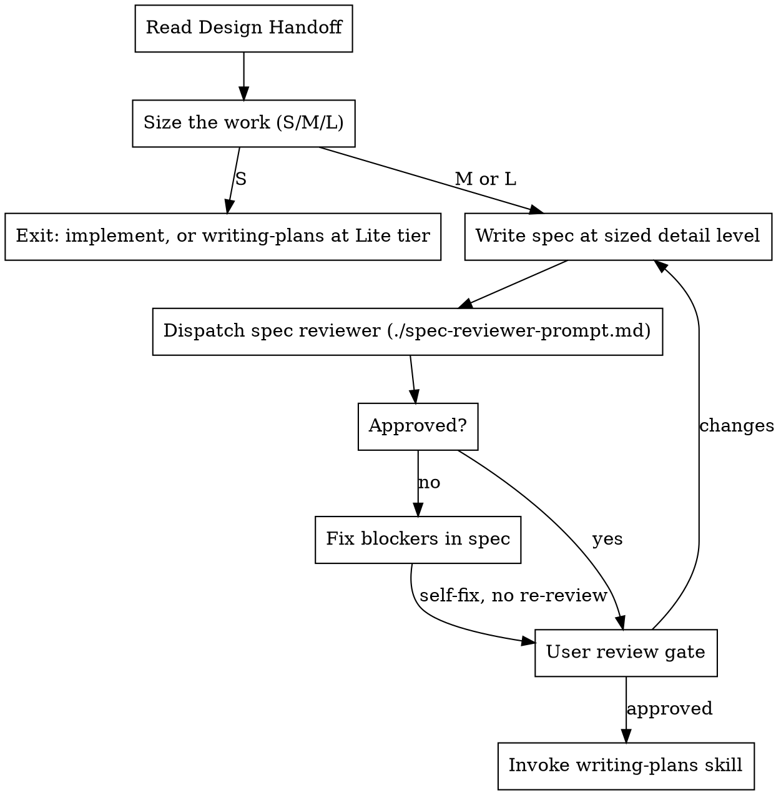

# Write Spec

## Overview

Author and validate a design spec from an approved brainstorming outcome. Size the work, write the spec, run **one** review pass, get user approval, then invoke writing-plans.

A spec is a **human-readable design note**: what you intend, what done looks like, how it works at name level, and what the implementer must respect. Prefer prose over tables. It is not an implementation plan. If a section could be pasted into a plan as-is — exact file paths, code blocks, step sequences — it belongs in writing-plans, not here.

**Announce at start:** "I'm using the write-spec skill to author and validate the design spec."

**Inputs:** Design Handoff artifact from brainstorming (path or structured block).

**Outputs:**
1. Spec file: `docs/playbook/specs/YYYY-MM-DD-<topic>-design.md`
2. Optional companion — same directory, `YYYY-MM-DD-<topic>-<kind>.md` where `<kind>` is `roadmap` or `adr` (only when the design needs a multi-spec slice or a durable decision record)

**Not an output: documentation updates.** This skill never edits canonical docs and never guesses which docs will need editing. Canonical docs explain current truth, and the code does not exist yet. Every plan's final work unit discovers and performs the doc updates from the real diff — see writing-plans.

## Checklist

You MUST create a task for each item and complete them in order:

1. **Read Design Handoff** — path or session block from brainstorming
2. **Size the work** — S / M / L; **S exits this skill**
3. **Write the spec** — at the detail level the size allows, save to `docs/playbook/specs/`
4. **Review pass** — dispatch one reviewer, fix blockers yourself, no re-review
5. **User review gate** — user approves the written spec
6. **Transition to planning** — invoke writing-plans

## Process Flow



**The terminal state is invoking writing-plans.** Do NOT write implementation plans, code, or invoke subagent-driven-development here.

<HARD-GATE>
Do NOT invoke writing-plans until the review pass is clean (or its blockers are fixed) AND the user approves the written spec. Do NOT edit canonical documentation in this skill. Do NOT commit until the user approves — and only when the user requests a commit.
</HARD-GATE>

## Step 1: Carry settled shapes

After reading the handoff, copy every concrete shape the conversation already agreed — fields a projection carries, entity relationships, API payloads, invariants — into Approach. If the handoff has no `### Shapes` and Approach never names contents, write none. Do not invent a data model so the spec looks complete.

## Step 2: Size the work

Detail is proportional to size. Decide the size **before** writing anything, and state it in the spec header.

| Size | Looks like | What to write |
|------|------------|---------------|
| **S** | One contained change: a component tweak, a copy change, a fix with a known cause, one endpoint's behavior | **No spec.** Implement directly, or write a **Lite** plan when the user wants an artifact — say the tier out loud so writing-plans does not default to its Full shape. |
| **M** | One capability or contained change — even when it touches several files, runtimes, or domains. No new product flow; Verification is usually a short Check | `Vision` (with `Target`), `Scope`, short `Verification`, plus `Approach` when the design introduces named units or picks a mechanism. Skip `Not now` when there is nothing to exclude. **Usual plan tier: Lite.** |
| **L** | Multiple independent capabilities in one spec, a complete user/system flow, or a new subsystem with Flow-level verification. Touching several domains alone is not L | All sections. **Usual plan tier: Full.** |

**Announce the size and why** in one sentence before writing. If the user disagrees, take their size.

**Multi-domain ≠ L.** A shared-package extraction, a cross-runtime contract move, or a change that lists several Affected domains is still M when it is one capability that stands or falls together. L is for scope that could be split into separate specs, or for a flow others will extend as a subsystem.

Brainstorming already decided whether a spec is warranted at all ("pipeline vs. local fix"). This step decides how much spec. When brainstorming handed off but the work is clearly **S**, say so and move on — do not pad a small change into a full spec.

**Size travels downstream.** Put the expected plan tier in the header (`Direct` / `Lite` / `Full`). writing-plans owns the final call and the tier definitions, but it starts from this hint — do not leave it blank and let "several files" upgrade an M spec into a Full plan.

## Step 3: Spec Format

Fixed section order. Section names are literal — use them verbatim.

| Section | Answers | Content rules |
|---------|---------|---------------|
| **Vision** | What are we intending, and what does done look like? | Human-readable prose. As long and as technical as the idea needs. Ends with **`### Target`**: free-text done state — not a table. |
| **Approach** | How does it work, and why these choices? | Named units and mechanisms in prose. Settled trade-offs live here next to what they decide — not in a separate Decisions table. |
| **Scope** | Where does this live and what must be respected? | Short bullets: areas, reuse, docs to read, skills, guardrails. **No file paths, no code.** |
| **Not now** | What are we not building? | Explicit exclusions, one per line. |
| **Verification** | How do we know it worked? | A few observable outcomes — not a unit-test inventory. See Verification. |

**Prefer prose over tables.** Specs are design notes people read. Tables are allowed only when a comparison is genuinely clearer as a grid (rare). Target, Approach, and Verification default to paragraphs and short bullets. A spec that is mostly tables fails the readability test.

**Header block** — every spec starts with it:

```markdown
**Size:** M      **Type:** frontend      **Plan tier:** Lite      **Depends on:** —
```

`Type` is `frontend`, `backend`, `data`, or `mixed`. It steers what Target should describe, not which table template to fill. `Plan tier` is the expected writing-plans tier (`Direct` / `Lite` / `Full`) — writing-plans may revise it, but only with a stated reason.

**`Depends on` — one canonical spec per concept.** Before writing, scan `docs/playbook/specs/` for specs whose subject overlaps this one. Declare each as a link with its relation: **depends on** (this consumes a contract, model, or flow that spec defines), **supersedes** (this replaces part of it — name the part), or **overlaps** (both touch a shared surface that could drift — name the surface). Reference the other spec's content; never restate it. Restated content becomes a second source of truth and will drift. Use `—` when there are none.

**Readability test:** after Vision (including Target), would a colleague who missed the brainstorm understand the intent and the done state in one sitting? If they would reach for a decoder ring, the spec fails review.

### Vision

Write the shared vision of what you intend to do with this work — in human form, for a reader who was not in the brainstorm. Length follows the idea: a small capability may need a paragraph; a cross-domain redesign may need a page. Be as technical as the idea needs to be clear. File paths and step sequences still belong in the plan, not here.

Cover what matters for shared understanding: the problem or opportunity in this project's context, what you intend to build, why it matters, and — when something already exists — what is wrong or incomplete about today. Do not pad, and do not truncate a real vision to hit a sentence count.

Every Vision ends with a **`### Target`** subsection — free text describing the done state. Write it as you would explain to a teammate: what exists when this is finished, how the important surfaces behave, what is gone. No Today/Done tables, no step grids unless a tiny comparison truly helps (and even then prefer two short paragraphs).

By `Type`, make sure Target covers the right kind of done state:

| Type | Cover in prose |
|------|----------------|
| **frontend** | What the user sees and can do when it is done; important UI states |
| **backend** | Who calls what, and what contracts or results exist at done |
| **data** | What the model or derivation looks like at done, and which consumers care |
| **mixed** | The cross-boundary outcome once — not one mini-essay per layer |

**Baseline is optional.** When something already exists, say what is wrong with today inside Vision or Target in a sentence or two. Greenfield needs no fake before-state.

Approach owns how the design works; Target owns what done looks like. Do not turn Target into a mechanism dump.

### Approach

The design the brainstorm settled, at a level someone can hold in their head — and the reasons that matter. Without this section the mechanism has nowhere to live and gets forgotten between chat and plan.

Write it as prose (short paragraphs or a few bullets), covering:

- **The rule** — the one or two sentences that make the change coherent, plus any corollaries.
- **Named units** — name each projection, module, package, view, job, or check and say what it is responsible for. Prefer a short paragraph or bullet per unit over a grid. "A named projection per surface" is not a design; naming them is.
- **Mechanism and why** — the load-bearing choices *and* why they won (view vs RPC, package vs importing the web app, vendor vs publish). Decisions live here, next to the thing they decide. Do not park them in a separate Decisions table.
- **Unchanged** — what this deliberately leaves alone, so the plan does not go looking.

**Level test — names, not locations.** If it would come up by name in a code review conversation, it belongs here. If it is a file path, a function signature, SQL, or a step sequence, it belongs in the plan.

**By size:** L always. M only when the design introduces named units or picks a mechanism — skip it when the change is behavior with an obvious implementation. S has no spec at all.

**No separate Decisions section.** A standalone Decisions table is legacy. If you find yourself building one, fold each row into the Approach paragraph it belongs to.

### Scope

This is the section that orients the implementer without doing the plan's job. Cover, in short bullets:

- **Areas and components involved** — named at component level: "the export dialog and the billing store", not `src/features/export/ExportDialog.tsx`
- **Reuse pointers** — what already exists that must be used instead of rebuilt: "a date-range picker already exists — extend it, do not add another"
- **Docs to read** — the canonical docs that *constrain* this work (see below)
- **Skills to use** — the domain skills that govern this work
- **Guardrails** — what the implementer must not violate: patterns to follow, boundaries not to cross, performance or accessibility floors that apply
- **Affected domains** — DocDriven domain IDs from `docs/agent/manifest.json`, when the project uses them. The plan's documentation work unit uses these to load route shards.

**Docs to read** is not a generic pointer at the docs folder — name the specific documents this work must obey, chosen by what is being built. Read the project's `docs/agent/manifest.json` route shards for the affected domains and take their `readFirst` entries as the starting point, then add anything the work type demands:

| Work involves | Name docs like |
|---------------|----------------|
| Frontend / UI | Frontend architecture, design language and visual system, component and state conventions, accessibility baseline |
| Backend / API | Backend architecture, API and contract conventions, auth and permission model, error and logging conventions |
| Data / schema | Data model doc, migration policy, derivation and read-model rules |
| Integrations / machine-to-machine | The integration's own contract doc, retry and idempotency policy, secret and credential handling |
| Infrastructure / deployment | Environment and config doc, deployment and rollback policy |

The list should be short and specific: three or four documents an implementer must read before starting, not everything that mentions the topic. If a needed doc does not exist, say so — that is a gap worth recording rather than an excuse to invent conventions.

**Skills to use** names the domain skills the implementer should invoke — the Supabase skill for edge functions and Postgres, the frontend design skill for new interface surfaces, the shadcn skill for component work, and so on. The plan repeats them per task; the spec establishes which apply at all.

**Docs to read are not docs to update.** Which docs need *updating* is discovered after the code exists — the plan's final work unit runs a change-scoped docdriven audit against the real diff. Do not try to predict that list here.

### Verification

How would a skeptical teammate know this worked? Write that — briefly.

**Default lean.** Prefer extending or running checks that already exist over inventing a new unit-test suite in the spec. Over-specifying tests is a review failure: a wall of Given/When/Then that mirrors every Approach unit usually means the spec is doing the plan's job and will produce unnecessary tests downstream.

| Tier | When | What to write |
|------|------|---------------|
| **Check** | Most M work; refactors; ownership moves; contract consolidations | One to three observable outcomes, or "run X existing suite / command and expect Y." Manual is fine when that is the honest bar. |
| **Component** | One new component or contained capability with real behavior branches | A handful of user-visible or API-visible cases — not one case per private function. |
| **Flow** | A complete user or system flow | A few end-to-end scenarios worth automating. Name the journey, not every assertion. |

State the tier. Prefer short bullets in plain language over formal Given/When/Then unless the form genuinely helps. Cap it: if you have more than about five bullets, you are writing a test plan — cut to the outcomes that would change a ship decision.

These outcomes are acceptance criteria for the plan. writing-plans turns them into verification steps; it must not invent a unit test for every named unit the Approach mentioned unless the outcome actually requires it.

### Global constraints (optional)

Project-wide requirements that bind every task: version floors, dependency limits, naming and copy rules. Include only when they exist. writing-plans copies this section into the plan verbatim.

### Canonical Template

````markdown
# <Feature Name>

**Size:** M      **Type:** mixed      **Plan tier:** Lite      **Depends on:** —

## Vision

<Prose: what you intend to build in this project's context, why it matters,
and what is wrong or incomplete about today when something already exists.
As long and as technical as the idea needs.>

### Target

<Free text: what done looks like. How the important surfaces behave. What is
gone. No required tables.>

## Approach

<Prose: the governing rule; each named unit and what it owns; the mechanism
choices and why they won; what stays unchanged.>

## Scope

**Areas involved**
- ...

**Reuse**
- ...

**Docs to read**
- `docs/knowledge/...` — why this one constrains the work

**Skills to use**
- ...

**Guardrails**
- ...

**Affected domains:** ...

## Not now
- ...

## Global constraints
- ... (optional)

## Verification

**Tier:** Check

- <Observable outcome, or existing command/suite to run and what it should show>
- <Only as many bullets as would change a ship decision>
````

There is no doc-impact section. Documentation updates are discovered from the real diff and performed by the plan's final work unit.

**Legacy specs** may use Problem / Goal / Non-Goals / Design / Testing Strategy, a standalone Decisions table, Today/Done grids, the older Vision Contract, or a top-level `Now → Target` section. Migrate when implementation touches them: fold decisions into Approach prose, Target into free text under Vision, and Blueprint file-level detail into the plan.

## Step 4: Review Pass

**One pass. One reviewer. No re-review.** Iterations that do not change the outcome are waste — the reviewer reports, you fix, you move on.

**Review subagent:** Check whether your runtime has a dedicated review subagent configured. **OpenCode:** use your `review` subagent (`Subagent (review):` in the prompt template). **Other runtimes:** look in platform config, agent manifests, or project docs for a subagent named `review`, `code-reviewer`, or similar with readonly/edit-deny permissions — use it when present. Fall back to `general-purpose` only when no review subagent exists. Do not substitute an inline self-review when a review subagent is available. When subagents are unavailable entirely, perform the same review scope yourself in readonly mode.

Dispatch using [spec-reviewer-prompt.md](spec-reviewer-prompt.md), filling in:
- `[SPEC_FILE_PATH]` — the saved spec
- `[HANDOFF_PATH]` — Design Handoff scratch file, or "session block"
- `[SPEC_SIZE]` — S / M / L from the header
- `[GLOBAL_CONSTRAINTS]` — the spec's Global constraints section, or "none"

**Scope:** placeholders, handoff fidelity, approach fidelity (named units and mechanism-with-why present in prose), human readability (prose over tables; Target is free text; no standalone Decisions table), project alignment, proportional verification (few outcomes, not a unit-test inventory), and scope discipline (no plan-level detail leaking in — names are not leakage).

**Dispatch rules:**
- Do not pre-judge findings — the reviewer raises, you adjudicate
- Do not paste session history — pass paths and constraints only
- Advisory items do not block; fix blockers unless the user chooses otherwise
- Fix blockers yourself and proceed — do not re-dispatch the reviewer
- When the runtime supports model selection for subagents, prefer a different model family from the authoring agent. Do not hard-code model slugs.

## Step 5: User Review Gate

After the review pass:

> "Spec written and reviewed at `<path>`. Please review and approve before we write the implementation plan."

Wait for user approval.

**On user changes:** edit the spec. Re-dispatch the reviewer only when the change alters what the spec claims about the project (new components, different current state, changed verification tier). Wording and scope trims do not need another pass.

**Commit:** do not commit until the user approves, and only when the user requests a commit. Commit the spec plus the handoff scratch file when one exists.

**Terminal state:** invoke writing-plans — no other skill.
