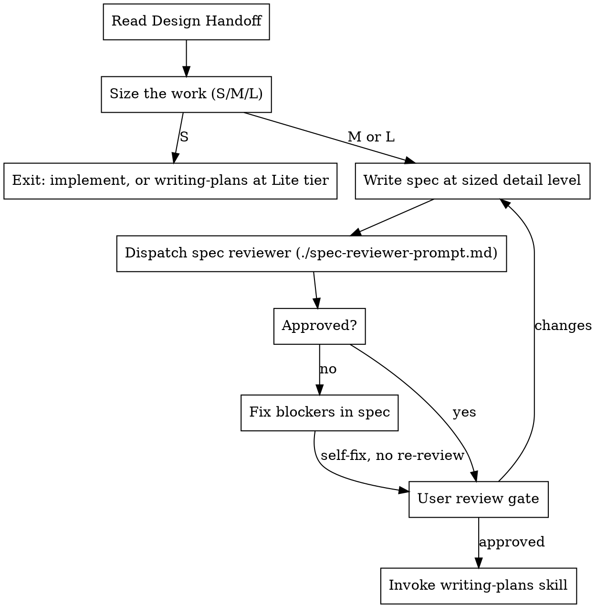

# Write Spec

## Overview

Author and validate a design spec from an approved brainstorming outcome. Size the work, write the spec, run **one** review pass, get user approval, then invoke writing-plans.

A spec is a **compact project-scoped overview**: what changes, where in the system it lives, and what the implementer must respect. It is not an implementation plan. If a section could be pasted into a plan as-is — exact file paths, code blocks, step sequences — it belongs in writing-plans, not here.

**Announce at start:** "I'm using the write-spec skill to author and validate the design spec."

**Inputs:** Design Handoff artifact from brainstorming (path or structured block).

**Outputs:**
1. Spec file: `docs/playbook/specs/YYYY-MM-DD-<topic>-design.md`
2. Optional companion — same directory, `YYYY-MM-DD-<topic>-<kind>.md` where `<kind>` is `roadmap` or `adr` (only when the design needs a multi-spec slice or a durable decision record)

**Not an output: documentation updates.** This skill never edits canonical docs and never guesses which docs will need editing. Canonical docs explain current truth, and the code does not exist yet. Every plan's final work unit discovers and performs the doc updates from the real diff — see writing-plans.

## Checklist

You MUST create a task for each item and complete them in order:

1. **Read Design Handoff** — path or session block from brainstorming
2. **Size the work** — S / M / L; **S exits this skill**
3. **Write the spec** — at the detail level the size allows, save to `docs/playbook/specs/`
4. **Review pass** — dispatch one reviewer, fix blockers yourself, no re-review
5. **User review gate** — user approves the written spec
6. **Transition to planning** — invoke writing-plans

## Process Flow



**The terminal state is invoking writing-plans.** Do NOT write implementation plans, code, or invoke subagent-driven-development here.

<HARD-GATE>
Do NOT invoke writing-plans until the review pass is clean (or its blockers are fixed) AND the user approves the written spec. Do NOT edit canonical documentation in this skill. Do NOT commit until the user approves — and only when the user requests a commit.
</HARD-GATE>

## Step 2: Size the work

Detail is proportional to size. Decide the size **before** writing anything, and state it in the spec header.

| Size | Looks like | What to write |
|------|------------|---------------|
| **S** | One contained change: a component tweak, a copy change, a fix with a known cause, one endpoint's behavior | **No spec.** Implement directly, or write a **Lite** plan when the user wants an artifact — say the tier out loud so writing-plans does not default to its Full shape. |
| **M** | One component or one contained capability; a few areas touched; no new architecture | `Vision` (with its `Target` subsection), `Scope`, `Verification`, plus `Approach` when the design introduces named units or picks a mechanism. Skip `Decisions` and `Not now` when there is nothing contested to record. Usually a **Lite** plan downstream. |
| **L** | A complete flow or feature; new architecture, new integration, cross-domain behavior, anything others will build on | All sections. A **Full** plan downstream. |

**Announce the size and why** in one sentence before writing. If the user disagrees, take their size.

Brainstorming already decided whether a spec is warranted at all ("pipeline vs. local fix"). This step decides how much spec. When brainstorming handed off but the work is clearly **S**, say so and move on — do not pad a small change into a full spec.

**Size travels downstream.** writing-plans sizes the plan itself (Direct / Lite / Full) and owns those definitions. Name the plan tier you expect when you hand off, so a small spec does not collect a full plan's ceremony on the way out.

## Step 3: Spec Format

Fixed section order. Section names are literal — use them verbatim.

| Section | Answers | Content rules |
|---------|---------|---------------|
| **Vision** | What are we intending to build, and what does done look like? | Shared vision in human form — as long and as technical as the idea needs. Ends with a **`### Target`** subsection: the concrete picture of the done state. |
| **Approach** | How does it work, at name level? | The governing rule, the named units it introduces, the mechanism where the choice matters. Names, not locations. |
| **Scope** | Where does this live and what must be respected? | Areas and components at name level, reuse pointers, docs to read, skills to use, guardrails. **No file paths, no code.** |
| **Decisions** | What is settled? | Lean table. Only entries someone might plausibly re-litigate. What the design *is* belongs in Approach; only the contested *why* belongs here. |
| **Not now** | What are we not building? | Explicit exclusions, one per line. |
| **Verification** | How do we know it works? | Scaled to what the spec delivers — see Verification Tiers. |

**Header block** — every spec starts with it:

```markdown
**Size:** M      **Type:** frontend      **Depends on:** —
```

`Type` is `frontend`, `backend`, `data`, or `mixed`. It selects the Vision `Target` subsection shape.

**`Depends on` — one canonical spec per concept.** Before writing, scan `docs/playbook/specs/` for specs whose subject overlaps this one. Declare each as a link with its relation: **depends on** (this consumes a contract, model, or flow that spec defines), **supersedes** (this replaces part of it — name the part), or **overlaps** (both touch a shared surface that could drift — name the surface). Reference the other spec's content; never restate it. Restated content becomes a second source of truth and will drift. Use `—` when there are none.

**Readability test:** after Vision (including its Target), would the user and the implementer describe the same outcome? If not, the spec fails review.

### Vision

Write the shared vision of what you intend to do with this work — in human form, for a reader who was not in the brainstorm. Length follows the idea: a small capability may need a paragraph; a cross-domain redesign may need a page. Be as technical as the idea needs to be clear. File paths and step sequences still belong in the plan, not here.

Cover what matters for shared understanding: the problem or opportunity in this project's context, what you intend to build, why it matters, and — when something already exists — what is wrong or incomplete about today. Do not pad, and do not truncate a real vision to hit a sentence count.

Every Vision ends with a **`### Target`** subsection. That is the concrete picture of the done state — tables, flows, contracts, schemas — so a reader can point at it and say "that is what we are building."

Pick the Target shape by `Type`:

| Type | Show |
|------|------|
| **frontend** | The user-facing flow and UI states at done — step table or Mermaid |
| **backend** | The contract or call sequence at done — endpoints, function names, who calls whom |
| **data** | The schema or derivation at done, plus which consumers are affected |
| **mixed** | The flow that crosses the boundary, once — not one section per layer |

**Baseline is optional.** When the work changes existing behavior, a short Today / After contrast (or a "Today" column) earns its keep. When the work is greenfield — nothing there yet — show only the target. Do not invent an empty before-state to fill the template.

Do not restate behavior that stays the same. Approach owns how the design works; Target owns what done looks like.

### Approach

The design the brainstorm settled, at a level someone can hold in their head. Without this section the mechanism has nowhere to live, and it ends up either dropped on the way out of brainstorming or crammed into the Decisions table.

Cover, in this order:

- **The rule** — the one or two sentences that make the change coherent, plus its corollaries. Everything else in the section should follow from it.
- **Named units** — the projections, modules, views, jobs, components, or checks this introduces or reshapes, as a table of name to responsibility. Name them. "A named projection per surface" is not a design; six named projections are.
- **Mechanism** — where the choice of mechanism is load-bearing: a view versus an RPC, a queue versus a cron, where a cache lives. One line each. The contested *why* goes to Decisions; what it *is* stays here.
- **Unchanged** — the structure this deliberately leaves alone, so the plan does not go looking.

**Level test — names, not locations.** If it would come up by name in a code review conversation, it belongs here. If it is a file path, a function signature, SQL, or a step sequence, it belongs in the plan. "`LibraryListRow`, served by one narrow repository method behind a `security_invoker` view" is a spec sentence. "`lib/library/read-models/list-library-documents.ts:130`" is a plan sentence.

**By size:** L always. M only when the design introduces named units or picks a mechanism — skip it when the change is behavior with an obvious implementation. S has no spec at all.

**This is where design detail belongs, so the other sections can stay in their lane.** A Decisions table past roughly eight rows, or a Vision `Target` that grew call-shape or mechanism prose, means the design is homeless — move it here.

### Scope

This is the section that orients the implementer without doing the plan's job. Cover, in short bullets:

- **Areas and components involved** — named at component level: "the export dialog and the billing store", not `src/features/export/ExportDialog.tsx`
- **Reuse pointers** — what already exists that must be used instead of rebuilt: "a date-range picker already exists — extend it, do not add another"
- **Docs to read** — the canonical docs that *constrain* this work (see below)
- **Skills to use** — the domain skills that govern this work
- **Guardrails** — what the implementer must not violate: patterns to follow, boundaries not to cross, performance or accessibility floors that apply
- **Affected domains** — DocDriven domain IDs from `docs/agent/manifest.json`, when the project uses them. The plan's documentation work unit uses these to load route shards.

**Docs to read** is not a generic pointer at the docs folder — name the specific documents this work must obey, chosen by what is being built. Read the project's `docs/agent/manifest.json` route shards for the affected domains and take their `readFirst` entries as the starting point, then add anything the work type demands:

| Work involves | Name docs like |
|---------------|----------------|
| Frontend / UI | Frontend architecture, design language and visual system, component and state conventions, accessibility baseline |
| Backend / API | Backend architecture, API and contract conventions, auth and permission model, error and logging conventions |
| Data / schema | Data model doc, migration policy, derivation and read-model rules |
| Integrations / machine-to-machine | The integration's own contract doc, retry and idempotency policy, secret and credential handling |
| Infrastructure / deployment | Environment and config doc, deployment and rollback policy |

The list should be short and specific: three or four documents an implementer must read before starting, not everything that mentions the topic. If a needed doc does not exist, say so — that is a gap worth recording rather than an excuse to invent conventions.

**Skills to use** names the domain skills the implementer should invoke — the Supabase skill for edge functions and Postgres, the frontend design skill for new interface surfaces, the shadcn skill for component work, and so on. The plan repeats them per task; the spec establishes which apply at all.

**Docs to read are not docs to update.** Which docs need *updating* is discovered after the code exists — the plan's final work unit runs a change-scoped docdriven audit against the real diff. Do not try to predict that list here.

### Verification Tiers

Pick the tier that matches what the spec actually delivers. Over-testing a small change is as much a review failure as under-testing a flow.

| Tier | When | Verification looks like |
|------|------|-------------------------|
| **Flow** | The spec delivers a complete user flow or feature — a new user flow, billing, a full information flow | Given / When / Then scenarios written as end-to-end tests: Playwright for frontend flows, request/response e2e for backend functions. Name each scenario so it becomes the test title. |
| **Component** | The spec delivers one component or one contained capability | Component-level checks: states and props behavior, or "extend existing test X with case Y". No full e2e. |
| **Check** | An M-sized change that rode through the spec anyway | One or two observable checks, manual acceptable. Proportionality over ceremony. |

State the tier explicitly so the reviewer can judge proportionality:

```markdown
## Verification

**Tier:** Flow

- **Given** a project with two exports pending, **when** the user opens the export dialog and confirms, **then** both exports move to running and the dialog closes.
```

Written this way, the scenarios **are** the acceptance criteria — writing-plans converts them into tests nearly verbatim. Do not add a separate acceptance-criteria section.

### Global constraints (optional)

Project-wide requirements that bind every task: version floors, dependency limits, naming and copy rules. Include only when they exist. writing-plans copies this section into the plan verbatim.

### Canonical Template

````markdown
# <Feature Name>

**Size:** L      **Type:** frontend      **Depends on:** [`YYYY-MM-DD-other-design.md`](./YYYY-MM-DD-other-design.md)

## Vision

<Shared vision in human form — as long and as technical as the idea needs:
what you intend to build in this project's context, why it matters, and what
is wrong or incomplete about today when something already exists.>

### Target

**Today** *(omit this block when the work is greenfield)*
| Step | What happens |
|------|--------------|
| ... | ... |

**Done**
| Step | What happens |
|------|--------------|
| ... | ... |

**UI states:** ...

## Approach

**Rule:** <the governing rule and its corollaries>

| Unit | Serves | Responsibility |
|------|--------|----------------|
| `<Name>` | <surface> | <what it carries> |

**Mechanism:** <the load-bearing mechanism choices, one line each>

**Unchanged:** <structure this leaves alone>

## Scope

**Areas involved**
- ...

**Reuse**
- ...

**Docs to read**
- `docs/knowledge/architecture/frontend.md` — state placement and data flow
- `docs/knowledge/design-language.md` — visual system this must match

**Skills to use**
- ...

**Guardrails**
- ...

**Affected domains:** ui, generation

## Decisions

| # | Decision | Why |
|---|----------|-----|
| 1 | ... | ... |

## Not now
- ...

## Global constraints
- ... (optional)

## Verification

**Tier:** Flow | Component | Check

- **Given** ..., **when** ..., **then** ...
````

There is no doc-impact section. Documentation updates are discovered from the real diff and performed by the plan's final work unit.

**Legacy specs** may use Problem / Goal / Non-Goals / Design / Testing Strategy, the older Vision Contract (Deliverables / Acceptance criteria / Locked decisions / Blueprint), or a top-level `Now → Target` section. Migrate to this format when implementation touches them: fold `Now → Target` into Vision's `### Target` subsection (baseline optional), and move Blueprint content that is file-level detail into the plan, not the new spec.

## Step 4: Review Pass

**One pass. One reviewer. No re-review.** Iterations that do not change the outcome are waste — the reviewer reports, you fix, you move on.

**Review subagent:** Check whether your runtime has a dedicated review subagent configured. **OpenCode:** use your `review` subagent (`Subagent (review):` in the prompt template). **Other runtimes:** look in platform config, agent manifests, or project docs for a subagent named `review`, `code-reviewer`, or similar with readonly/edit-deny permissions — use it when present. Fall back to `general-purpose` only when no review subagent exists. Do not substitute an inline self-review when a review subagent is available. When subagents are unavailable entirely, perform the same review scope yourself in readonly mode.

Dispatch using [spec-reviewer-prompt.md](spec-reviewer-prompt.md), filling in:
- `[SPEC_FILE_PATH]` — the saved spec
- `[HANDOFF_PATH]` — Design Handoff scratch file, or "session block"
- `[SPEC_SIZE]` — S / M / L from the header
- `[GLOBAL_CONSTRAINTS]` — the spec's Global constraints section, or "none"

**Scope:** placeholders, handoff fidelity, approach fidelity (the rule, named units, and mechanism the handoff approved are present and named), readability test, project alignment (does Vision's Target match reality when it includes a baseline, do the named components and reuse pointers exist), proportionality (detail and verification tier match the size), and scope discipline (no plan-level detail leaking in — names are not leakage).

**Dispatch rules:**
- Do not pre-judge findings — the reviewer raises, you adjudicate
- Do not paste session history — pass paths and constraints only
- Advisory items do not block; fix blockers unless the user chooses otherwise
- Fix blockers yourself and proceed — do not re-dispatch the reviewer
- When the runtime supports model selection for subagents, prefer a different model family from the authoring agent. Do not hard-code model slugs.

## Step 5: User Review Gate

After the review pass:

> "Spec written and reviewed at `<path>`. Please review and approve before we write the implementation plan."

Wait for user approval.

**On user changes:** edit the spec. Re-dispatch the reviewer only when the change alters what the spec claims about the project (new components, different current state, changed verification tier). Wording and scope trims do not need another pass.

**Commit:** do not commit until the user approves, and only when the user requests a commit. Commit the spec plus the handoff scratch file when one exists.

**Terminal state:** invoke writing-plans — no other skill.
