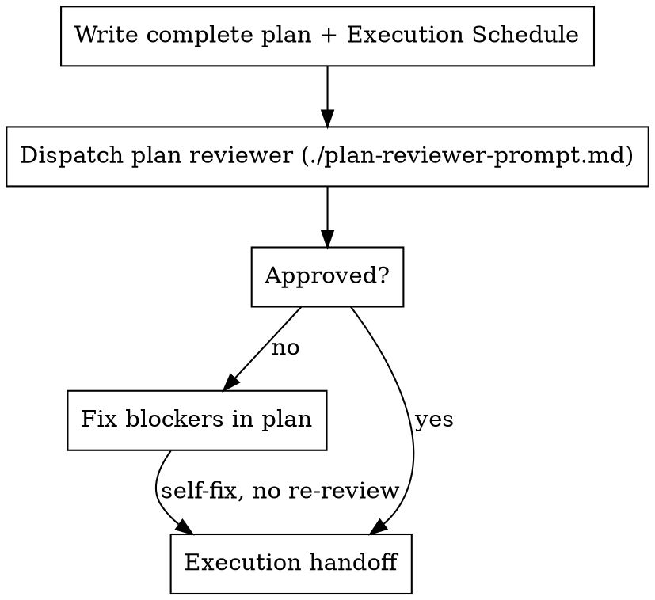

# Writing Plans

## Overview

Write comprehensive implementation plans assuming the engineer has zero context for our codebase and questionable taste. Document everything they need to know: which files to touch for each task, code, testing, docs they might need to check, how to test it. Give them the whole plan as bite-sized tasks. DRY. YAGNI. TDD. Frequent commits.

Assume they are a skilled developer, but know almost nothing about our toolset or problem domain. Assume they don't know good test design very well.

**Announce at start:** "I'm using the writing-plans skill to create the implementation plan."

**Upstream:** The spec should have passed write-spec's review pass and user approval. Plan review verifies traceability, buildability, parsimony, and execution topology — do not re-audit whether the design is doable, settled upstream.

**Downstream of the spec:** the spec is a compact project-scoped overview — it names components and areas, not files. This plan owns all file-level detail. The spec's `Verification` scenarios become real tests, and the plan's final work unit updates the documentation from the implemented diff.

**Context:** If working in an isolated worktree, it should have been created via the `playbook:using-git-worktrees` skill at execution time.

**Save plans to:** `docs/playbook/plans/YYYY-MM-DD-<feature-name>.md`
- (User preferences for plan location override this default)

## When to skip

Skip this skill when the change is already scoped and small — one or two files, no design open questions, done state obvious from the request. Implement directly instead.

Use this skill when the work spans multiple tasks, files, or test surfaces, or when you need an Execution Schedule for subagent dispatch. If the user asks for a plan on a small change anyway, write a short one — you do not need the full task template for a one-line fix.

## Tasks vs Work Units

Plans use two levels of decomposition:

| Concept | Purpose | Granularity |
|---------|---------|-------------|
| **Task** | Planning fidelity — files, interfaces, TDD steps | Smallest independently testable chunk |
| **Work unit (WU)** | Execution dispatch — one subagent, reviewed at the next checkpoint | 15–45 min of focused work; often spans multiple tasks |

**Steps** (2–5 min TDD actions) live inside tasks. **Tasks** define what to build in detail. **Work units** define how subagent-driven development dispatches the work — they are often 1:1 with a task but frequently group 2–5 related tasks into one subagent dispatch.

Do not conflate them: a detailed plan may have 12 tasks and 4 work units.

## Scope Check

If the spec covers multiple independent subsystems, it should have been broken into sub-project specs during brainstorming. If it wasn't, suggest breaking this into separate plans — one per subsystem. Each plan should produce working, testable software on its own.

## File Structure

Before defining tasks, map out which files will be created or modified and what each one is responsible for. This is where decomposition decisions get locked in.

- Design units with clear boundaries and well-defined interfaces. Each file should have one clear responsibility.
- You reason best about code you can hold in context at once, and your edits are more reliable when files are focused. Prefer smaller, focused files over large ones that do too much.
- Files that change together should live together. Split by responsibility, not by technical layer.
- In existing codebases, follow established patterns. If the codebase uses large files, don't unilaterally restructure - but if a file you're modifying has grown unwieldy, including a split in the plan is reasonable.

This structure informs the task decomposition. Each task should produce self-contained changes that make sense independently.

## Task Right-Sizing

A task is the smallest unit that carries its own test cycle. When drawing task boundaries: fold setup, configuration, scaffolding, and documentation steps into the task whose deliverable needs them; split only where the deliverable or test surface is genuinely separate. Each task ends with an independently testable deliverable.

Task boundaries optimize for **planning clarity**, not subagent dispatch. Dispatch boundaries are defined later in the Execution Schedule.

## Bite-Sized Task Granularity

**Each step is one action (2-5 minutes):**
- "Write the failing test" - step
- "Run it to make sure it fails" - step
- "Implement the minimal code to make the test pass" - step
- "Run the tests and make sure they pass" - step
- "Commit" - step

## Plan Document Header

**Every plan MUST start with this header:**

```markdown
# [Feature Name] Implementation Plan

> **For agentic workers:** REQUIRED SUB-SKILL: Use playbook:subagent-driven-development (recommended) or playbook:executing-plans to implement this plan. Steps use checkbox (`- [ ]`) syntax for tracking.

**Goal:** [One sentence describing what this builds]

**Architecture:** [2-3 sentences about approach]

**Tech Stack:** [Key technologies/libraries]

## Global Constraints

[The spec's project-wide requirements — version floors, dependency limits,
naming and copy rules, platform requirements — one line each, with exact
values copied verbatim from the spec. Every task's requirements implicitly
include this section.]

## Execution Schedule

Write this with the plan — one row per work unit:

| WU | Tasks | Summary | Files (write) | Depends on | Wave | Review |
|----|-------|---------|---------------|------------|------|--------|
| WU-1 | 1–2 | Auth types + store | `src/auth/types.ts`, ... | — | 1 | — |
| WU-2 | 3–5 | Export parser | `src/export/parser.ts`, ... | — | 1 | — |
| WU-3 | 6 | Export API wiring | `src/api/export.ts` | WU-1, WU-2 | 2 | ✅ checkpoint |
| WU-4 | 7 | Documentation update (docdriven) | `docs/...` | WU-3 | 3 | ✅ checkpoint |

- **Tasks:** inclusive range of plan task numbers this work unit implements
- **Depends on:** work units that must complete before this one starts
- **Wave:** parallel group — work units in the same wave have no blocking dependencies on each other and must not write the same files
- **Review:** `✅ checkpoint` marks a review gate after this work unit; `—` means execution continues straight to the next work unit

---
```

The Execution Schedule is required before plan review. Do not offer execution without it.

**Work unit sizing:**
- **Merge** tasks when: same files, pure scaffolding for the next task, or dispatch overhead would dominate (< ~15 min of work)
- **Keep separate** when: different subsystems, different test surfaces, or a reviewer could reject one while approving its neighbor
- **Target:** 15–45 minutes of focused implementer time, 1–5 commits, one cohesive deliverable per work unit

**Parallelization:**
- Assign a **wave** number to each work unit
- Work units in the same wave have no `Depends on` relationship to each other
- Work units in the same wave must have **disjoint write file sets**
- Integration/wiring work units go in later waves after their dependencies

## Review Checkpoints

**The plan decides where implementation gets reviewed.** Reviewing after every work unit spends real time without producing progress; reviewing only at the very end lets an early mistake get built on. Checkpoints sit at the boundaries where a mistake would actually be expensive.

Place a checkpoint on a work unit when:

- It **completes a logical package** — a coherent slice of behavior that stands on its own (the data layer is done, the parser works end to end)
- **Other work units depend on it.** The `Depends on` column is the signal: when several later work units consume a work unit or group, review before they build on it
- It is the **last code work unit** — required
- It is the **documentation work unit** — required

Do not mark a checkpoint on every work unit. Target roughly **one checkpoint per two to four work units**, plus the two required ones. A three-work-unit package with a checkpoint at its end is right; three consecutive checkpoints inside it is not.

A checkpoint reviews **everything since the previous checkpoint**, not just the last work unit — the reviewer sees the whole package as one diff, which is also how it catches integration problems a single-unit review misses.

## Documentation Work Unit (mandatory)

**Every plan's final work unit is the documentation update.** It is always in its own last wave, depends on all preceding work units, and always carries a review checkpoint. A plan without it is incomplete and fails plan review.

Copy [docs-work-unit-template.md](docs-work-unit-template.md) into the plan as its final task, filling in the feature name and affected domains.

The work unit **discovers** what to document rather than following a pre-written list, and it delegates both halves of that job:

| Job | Skill |
|-----|-------|
| Find which docs became false, from the diff | playbook:docdriven-audit, change-scoped mode |
| Write the updates correctly | playbook:docdriven |

Why discovery instead of a list: at spec time the code does not exist, so any list of docs to update is a guess that goes stale as soon as a plan task changes. At the end of implementation the evidence is real. This also means the docs describe what was **built** — where implementation diverged from the spec, the divergence gets documented and recorded in `gaps.md` instead of silently contradicting the docs.

**Do not restate documentation rules in the plan.** One canonical explanation per concept applies to this skill too: the plan's docs task names the two skills and the diff range, and those skills carry the procedure.

## Task Structure

````markdown
### Task N: [Component Name]

**Files:**
- Create: `exact/path/to/file.py`
- Modify: `exact/path/to/existing.py:123-145`
- Test: `tests/exact/path/to/test.py`

**Interfaces:**
- Consumes: [what this task uses from earlier tasks — exact signatures]
- Produces: [what later tasks rely on — exact function names, parameter
  and return types. A task's implementer sees only their own task; this
  block is how they learn the names and types neighboring tasks use.]

- [ ] **Step 1: Write the failing test**

```python
def test_specific_behavior():
    result = function(input)
    assert result == expected
```

- [ ] **Step 2: Run test to verify it fails**

Run: `pytest tests/path/test.py::test_name -v`
Expected: FAIL with "function not defined"

- [ ] **Step 3: Write minimal implementation**

```python
def function(input):
    return expected
```

- [ ] **Step 4: Run test to verify it passes**

Run: `pytest tests/path/test.py::test_name -v`
Expected: PASS

- [ ] **Step 5: Commit**

```bash
git add tests/path/test.py src/path/file.py
git commit -m "feat: add specific feature"
```
````

## No Placeholders

Every step must contain the actual content an engineer needs. These are **plan failures** — never write them:
- "TBD", "TODO", "implement later", "fill in details"
- "Add appropriate error handling" / "add validation" / "handle edge cases"
- "Write tests for the above" (without actual test code)
- "Similar to Task N" (repeat the code — the engineer may be reading tasks out of order)
- Steps that describe what to do without showing how (code blocks required for code steps)
- References to types, functions, or methods not defined in any task

**One exception:** the documentation work unit's file list is discovered at execution time, because which docs became false is only knowable from the finished diff. Its steps must still be complete — the discovery procedure itself is the content.

## Remember
- Exact file paths always
- Complete code in every step — if a step changes code, show the code
- Exact commands with expected output
- DRY, YAGNI, TDD, frequent commits

## Plan Review

**Review subagent:** Before dispatching, check whether your runtime has a dedicated review subagent configured. **OpenCode:** use your `review` subagent (`Subagent (review):` in [plan-reviewer-prompt.md](plan-reviewer-prompt.md)). **Other runtimes:** look in platform config, agent manifests, or project docs for a subagent named `review`, `code-reviewer`, or similar with readonly/edit-deny permissions — use it when present. Fall back to `general-purpose` only when no review subagent exists. Do not substitute an inline self-review when a review subagent is available.

When subagents are **not** available at all, perform the same review scope yourself in readonly mode.

After writing and saving the complete plan (including Execution Schedule), dispatch **one** readonly plan reviewer. Fix blockers yourself — do not re-dispatch the reviewer after self-fixes.



### Plan reviewer

Dispatch using [plan-reviewer-prompt.md](plan-reviewer-prompt.md) — `review` subagent on OpenCode, otherwise configured review subagent or `general-purpose`.

Fill in:
- `[PLAN_FILE_PATH]` — the saved plan
- `[SPEC_FILE_PATH]` — the spec this plan implements
- `[GLOBAL_CONSTRAINTS]` — copy verbatim from the plan's Global Constraints section

**Scope:** Spec traceability, buildability (placeholders, types, DRY), **parsimony** (no unnecessary new components, types, or files where something existing should be extended; fixtures and test helpers reused), and Execution Schedule topology — including the mandatory documentation work unit and sane review checkpoints. Do not re-audit whether the design is doable — write-spec settled that.

**If Issues Found:** Fix blockers in the plan yourself. Do not re-dispatch the reviewer unless the user edits the plan or you changed scope (added/removed tasks).

### Reviewer prompt rules

- Do not pre-judge findings — let the reviewer raise issues; you adjudicate when fixing
- Do not paste session history into reviewer dispatches — paths and global constraints only
- Advisory items do not block approval; fix blockers only unless you choose to act on advisory suggestions
- If a finding conflicts with an intentional spec decision, present both to the user and ask which governs

## Execution Handoff

After plan review passes (or you fixed blockers yourself), offer execution choice:

**"Plan complete and saved to `docs/playbook/plans/<filename>.md`. Two execution options:**

**1. Subagent-Driven (recommended)** - I dispatch a fresh subagent per work unit, parallel within waves, review at the plan's checkpoints

**2. Inline Execution** - Execute work units in this session using executing-plans, batch execution with checkpoints

**Which approach?"**

**If Subagent-Driven chosen:**
- **REQUIRED SUB-SKILL:** Use playbook:subagent-driven-development
- Fresh subagent per work unit + review after each + parallel within waves

**If Inline Execution chosen:**
- **REQUIRED SUB-SKILL:** Use playbook:executing-plans
- Batch execution with checkpoints for review
